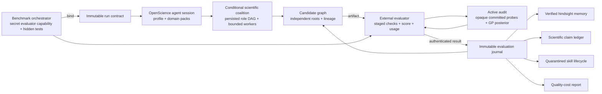

# Scientific benchmark harness

OpenScience has a benchmark-facing control plane for scientific agents. It binds an immutable run protocol before execution, routes the session through a domain-appropriate method, accepts results only from the bound evaluator, and keeps optimization, evidence, reusable memory, claims, and cost reporting attached to that protocol.

This is a **state-of-the-art-oriented harness architecture**, not a claim of state-of-the-art benchmark performance. A score becomes a SOTA claim only after an official, reproducible run beats the relevant public baseline under a comparable protocol. The harness is designed to make that test difficult to game and easy to audit.

## Design invariants

1. **The task is frozen before the agent runs.** Benchmark identity, version, task, split, evaluator, metric, direction, model, tools, skills, budgets, seed, intervention policy, and contamination policy are hashed into an immutable contract.
2. **The evaluator is outside the agent loop.** The orchestrator holds a bearer capability. OpenScience stores only its SHA-256 digest and never returns the token in the contract.
3. **Self-report is not evidence.** Agent observations cannot promote candidates, support scientific claims, enter verified memory, or qualify learned skills.
4. **Search has lineage and a hard budget.** Every candidate binds its parent(s), branch, proposal, and content-addressed artifact. Only final, externally evaluated passing candidates can become parents.
5. **Cheap screens cannot become final scores.** Optional fidelity stages execute in order. Only the last stage can promote a candidate, enter verified memory, appear as report quality, or qualify a skill.
6. **Scientific validity is domain-specific.** Benchmark adapters select blocking verification packs for statistics, biology, physics, PDEs, chemistry, ML, and forecasting.
7. **Learning is quarantined.** A trajectory can propose a skill, but cannot activate it. Promotion requires paired held-out candidate/control evidence across multiple tasks and an unchanged content hash.
8. **Quality is reported with cost.** Comparable reports include score, pass state, model and intervention metadata, total tokens, wall time, cost, candidate count, and search state.
9. **Coordination must earn its cost.** The contract can pin a topology, or a deterministic policy can choose direct, centralized, fork/join, tournament, or evolutionary execution from bounded task traits. Tool-heavy sequential work is not automatically expanded into a multi-agent swarm.
10. **Evaluation actively looks for blind spots.** An optional evaluator-owned audit uses committed opaque probes, uncertainty reduction, failure UCB, diversity, and stratum coverage. Its estimate must abstain while uncertainty remains above the contract threshold and cannot promote itself into benchmark evidence.
11. **Numerical validation is authenticated and recomputed.** A simulation claim pins the engine, effective problem, reference, convergence order, residual/invariant tolerances, and stress tests. A final pass must cite a passing evaluator receipt for the exact artifact.
12. **Feature attribution is predeclared and paired.** Harness architecture claims require at least three evaluator-authenticated, same-seed baseline/arm pairs frozen before any result exists. Exactly one declared contract factor may differ.

## System boundary



The bearer capability and hidden tests must live in a separate process, container, VM, or account that the agent cannot inspect. Application-level hashing prevents accidental drift and API forgery; it is not an operating-system sandbox. OpenScience's ordinary agent runtime can execute local code, so a same-user process with unrestricted filesystem access is outside this threat model.

## Run lifecycle

### 1. Bind

The orchestrator calls `POST /harness/runs` before the model sees the task. The request selects a version-agnostic adapter and supplies the exact benchmark version and evaluator protocol.

```json
{
  "schemaVersion": 1,
  "runID": "mle-2026-08-task-17-seed-3",
  "sessionID": "session-id",
  "benchmark": "mle",
  "version": "official-release-sha-or-version",
  "taskID": "competition-id",
  "split": "held_out",
  "evaluator": {
    "name": "official-evaluator",
    "version": "evaluator-sha",
    "source": "benchmark",
    "token": "out-of-band-secret-with-at-least-32-characters"
  },
  "objective": "Maximize the official held-out score",
  "orchestration": {
    "topology": "auto",
    "maxWorkers": 2,
    "maxRounds": 3,
    "minIndependentVerifiers": 2
  },
  "audit": {
    "mode": "hybrid",
    "budget": 50,
    "minSamples": 10,
    "tolerance": 0.02,
    "maxUncertainty": 0.05,
    "targetFailures": 8
  },
  "simulation": {
    "kind": "pde",
    "engine": {
      "name": "reference-solver",
      "version": "1.2.3",
      "commandSHA256": "aaaaaaaaaaaaaaaaaaaaaaaaaaaaaaaaaaaaaaaaaaaaaaaaaaaaaaaaaaaaaaaa",
      "configSHA256": "bbbbbbbbbbbbbbbbbbbbbbbbbbbbbbbbbbbbbbbbbbbbbbbbbbbbbbbbbbbbbbbb"
    },
    "problemSHA256": "cccccccccccccccccccccccccccccccccccccccccccccccccccccccccccccccc",
    "reference": {
      "kind": "manufactured",
      "identity": "manufactured-solution-v1",
      "sha256": "dddddddddddddddddddddddddddddddddddddddddddddddddddddddddddddddd"
    },
    "validation": {
      "errorNorm": "relative L2",
      "minLevels": 3,
      "maxLevels": 6,
      "expectedOrder": 2,
      "orderTolerance": 0.2,
      "maxResidual": 1e-8,
      "invariantTolerances": { "mass_drift": 1e-6 },
      "requiredStressTests": ["solver_tolerance_sensitivity", "reference_replay"]
    }
  },
  "metric": { "name": "score", "direction": "maximize" },
  "fidelities": [
    { "id": "smoke", "final": false, "maxWallTimeMs": 300000 },
    { "id": "official", "final": true, "maxWallTimeMs": 43200000 }
  ],
  "model": { "provider": "provider", "name": "model", "effort": "high" },
  "tools": ["read", "bash", "edit"],
  "skills": [],
  "budget": { "steps": 200, "candidates": 30, "tokens": 1000000, "costUSD": 100 },
  "seed": 3,
  "intervention": "autonomous",
  "contamination": {
    "policy": "Hidden tests and outputs stay outside the agent process",
    "hiddenTestsAccessible": false,
    "publicDataCutoff": "2026-08-01"
  },
  "createdAt": 1785859200000
}
```

Rebinding the session with any changed field or evaluator capability fails.

### 2. Execute through a profile

The contract overrides heuristic routing. Unbound interactive sessions use a conservative `react` default and select a specialized profile only from strong task signals.

| Profile     | Intended work                                       | Required discipline                                                |
| ----------- | --------------------------------------------------- | ------------------------------------------------------------------ |
| `react`     | Direct tool-using tasks                             | Smallest reliable execution path                                   |
| `optimize`  | MLE, algorithm, or score optimization               | Candidate lineage, external scores, bounded exploration            |
| `reproduce` | Papers, published analyses, and benchmark artifacts | Claim extraction, protocol replay, clean verification              |
| `theory`    | Analytical physics and mathematical derivation      | Assumptions, dimensions, limits, independent route                 |
| `numerical` | PDEs and simulation                                 | Equation/BC/IC pinning, stability, convergence, reference solution |
| `training`  | Fine-tuning and post-training                       | Data/model identity, checkpoints, held-out evaluation, compute     |
| `forecast`  | Weather and spatiotemporal prediction               | Lead-time portfolio, calibration, leakage, baseline, compute       |

### 3. Orchestrate only when justified

`POST /harness/runs/:sessionID/orchestration` freezes a deterministic role graph beside the immutable contract. Its selector considers decomposability, sequentiality, tool intensity, uncertainty, verification risk, novelty, cross-domain structure, and available coordination budget.

| Topology      | Use case                                               | Role structure                                                          |
| ------------- | ------------------------------------------------------ | ----------------------------------------------------------------------- |
| `solo`        | Small-budget, sequential, or low-coordination work     | One direct generation unit                                              |
| `centralized` | Tool-heavy or high-risk work with limited parallelism  | Generate → reflect → independently verify                               |
| `fork_join`   | Decomposable analytical and computational work         | Generate ∥ simulate → synthesize → independently verify                 |
| `tournament`  | Uncertain, verification-sensitive hypothesis selection | Independent generation → cluster → reflect → pairwise rank → verify     |
| `evolution`   | Novel, open-ended search                               | Generate → cluster → reflect → rank → evolve/diverge, repeated by round |

Every work unit has a content-derived identity, ordered dependencies, a role-specific agent, and a proportional allocation from the contract budget. A role can settle only from a fresh child session after all dependencies complete. Failure cancels transitive descendants without erasing independent roots. Restarts reload the exact graph rather than re-planning it.

Upstream communication is deliberately bounded to summaries plus artifact and evidence references. Verifiers run in distinct child sessions, cannot see each other's verdicts, and must return `support`, `reject`, or `abstain` with calibrated confidence and evidence-backed checks. The harness aggregates only after the whole panel settles: one verdict is `insufficient`, unanimous support/rejection is preserved, and any split or abstaining panel is `disputed`. Internal reflection, ranking, verification, and consensus remain provisional; only the evaluator-authenticated journal can establish benchmark performance or scientific support.

### 4. Search without erasing failures

The optimizer is an open candidate graph rather than a single mutable working file.

- Candidate IDs hash parents, branch, proposal, artifact URI, and artifact SHA-256.
- The graph admits multiple independent roots early, bounded by `min(4, max(2, ceil(sqrt(candidate budget))))`.
- A root must use a distinct branch while another live root with that branch exists.
- Descendants require final, evaluator-verified passing parents. A cheap screening pass is insufficient.
- Early selection opens independent roots and then applies branch-level UCB-style exploration with minimum-visit protection.
- After half the candidate budget, selection exploits the strongest verified branch.
- At the configured stall threshold it fuses two strong, distinct branches. At twice that threshold it recommends a strategy-level mutation while preserving the best parent.
- Self-reported observations remain visible for debugging but cannot enter elite state or lineage.
- Passing, failing, and inconclusive final evaluations are immutable and retained as hindsight.

This combines breadth, exploitation, fusion, and escape from strategy stagnation without allowing the model to award itself fitness.

### 5. Cascade evaluation

Fidelity plans contain two to eight unique stages and exactly one final stage, which must be last. The journal enforces stage order per run or candidate. Every prior stage must pass all blocking checks before the next result can be recorded.

If a stage declares a wall-time or cost cap, the evaluator must report the corresponding usage and the result is rejected when it exceeds the cap. Screening evaluations can cull candidates and attach feedback, but cannot:

- become the search best;
- create descendants;
- satisfy final domain packs;
- enter verified retrospective memory;
- become the quality score in a report; or
- qualify a learned skill.

### 6. Actively audit performance and failure regions

An active audit is part of the external evaluator boundary. The run contract freezes its mode, budget, minimum sample count, kernel/noise settings, confidence multiplier, failure threshold, precision and abstention thresholds, objective weights, and optional failure target.

The evaluator initializes an audit with an immutable subject artifact plus two to 2,000 probe records. Each probe contains only:

- an opaque ID;
- a SHA-256 commitment to the hidden case bytes;
- a bounded numeric feature vector;
- a stratum label;
- an evaluation weight; and
- a prior loss estimate.

The hidden prompt, target, and expected output never enter OpenScience. Numeric features are standardized inside the audit before applying an RBF Gaussian-process surrogate.

At each round, the audit selects exactly one probe. Performance mode maximizes the reduction in weighted integral variance. Failure mode combines posterior loss UCB with distance from already-discovered failures and under-covered strata. Hybrid mode combines both acquisitions using the contract weight. Selection is deterministic, persisted, and restart-idempotent.

Only the bound evaluator capability can initialize, select, read, or submit outcomes. An observation must cite evidence, cannot be changed later, and must label failure consistently with the frozen loss threshold. The audit stops on its sample budget, pool exhaustion, requested failure count, or—outside pure failure mode—sufficient posterior precision after the minimum sample count.

The report carries posterior mean loss, standard deviation, a clipped 95% interval, failure count, stratum coverage, and an explicit abstention bit. This is an audit estimate, not an official result. The external evaluator must attach its receipt to an ordinary authenticated evaluation before it can affect benchmark state.

### 7. Authenticate numerical simulation claims

An optional simulation contract freezes the physical and numerical protocol before execution: simulation kind; engine name/version; hashes of the effective command, configuration, and complete problem statement; reference kind/identity/hash; error norm; refinement range; expected order; residual and invariant tolerances; and mandatory stress tests.

The bound evaluator submits level measurements and evidence to `POST /harness/simulations/receipts`. OpenScience does not accept a producer-supplied pass flag. It recomputes decreasing resolution/error, requires every local observed convergence order to meet the frozen threshold, and checks residual bounds, every declared invariant, and the exact stress-test set. Both passing and failed receipts remain append-only and content-addressed.

A candidate receipt must name the candidate's exact artifact URI and SHA-256 from the search graph. A run receipt binds its output artifact to the run. A final passing evaluation under a simulation contract must cite a passing receipt for the same run or candidate; a missing, failed, wrong-contract, or wrong-artifact receipt blocks promotion. The capability and hidden reference outputs remain outside the agent process.

### 8. Verify with domain packs

Final passing results must contain evidence-backed receipts for every blocking check selected by the adapter.

| Pack       | Representative blocking checks                                                                     |
| ---------- | -------------------------------------------------------------------------------------------------- |
| Statistics | estimand, assumptions, effect size, uncertainty, multiplicity, exact replay                        |
| Biology    | identifiers, design, QC, batch structure, covariates, multiplicity, biological validity            |
| Physics    | assumptions, units, conventions, limiting cases, conservation, independent derivation              |
| PDE        | equation, domain, BC/IC, discretization, convergence, stability, invariants, reference, error norm |
| Chemistry  | identity, standardization, valence, stereochemistry, conditions, split leakage, physical validity  |
| ML         | data/model identity, held-out split, leakage, baseline, metric, seed variance, compute             |
| Forecast   | dataset/init/grid/leads, full metric portfolio, mode, calibration, temporal leakage, compute       |

An adapter can require no universal pack when the benchmark spans incompatible task types; the orchestrator may add task-specific packs at bind time. Pack selection is frozen in the contract and comparison key.

### 9. Reuse only verified hindsight

Retrospective entries are scoped by benchmark name, version, task, and evaluator. They contain the exact candidate artifact reference, branch, generation, external outcome, score, metrics, evidence references, evaluator feedback, and evaluation usage.

Retrieval combines query overlap, task affinity, and workflow stage. It deliberately returns a relevant contrasting failure beside a success when possible. Retrieved text is escaped, length-bounded, and explicitly labeled as precedent data rather than instructions.

### 10. Keep claims separate from execution reports

The claim ledger supports descriptive, statistical, causal, mechanistic, theoretical, and performance claims. Status is derived from verified evidence, never assigned by the agent.

- Observations can make a claim provisional, but not supported.
- A refuting verified source wins over supporting sources.
- Support requires the claim's blocking checks and enough distinct independence keys.
- Headline performance claims must bind an immutable artifact SHA-256.
- Clean replay, independent implementation, and independent derivation require a separate verifier session, fresh process, clean workspace, and exact source hash.
- Independent implementation/derivation additionally withhold the producer's output and require independent code or reasoning.

### 11. Promote skills only after held-out qualification

`/learn` and RSI distillation write inert proposals under `learned-skill-proposals`; skill discovery reads only promoted content under `learned-skills`.

Before a proposal exists, OpenScience checks its frontmatter, runtime-risk patterns, prompt-injection patterns, and suspicious content. The proposal is then immutable by content hash. Promotion requires:

- otherwise-identical candidate and control contracts;
- the candidate contract pinned to the exact proposed skill SHA-256;
- evaluator capabilities for both runs;
- held-out or release splits;
- at least three distinct benchmark tasks;
- at least two strict score improvements;
- no candidate failure and no regression;
- a held-out skill-trigger set with at least 20 examples; and
- trigger precision and recall of at least 0.8 for every attestation.

If later evidence introduces a regression before promotion, qualification returns to pending. Promoted content cannot accept more evidence; changes require a new versioned proposal.

### 12. Execute benchmark-native protocol skills

The bundled skill catalog includes three executable protocols for work that is otherwise easy to describe but hard to audit:

| Skill                        | Executable contract                                                                                                                        |
| ---------------------------- | ------------------------------------------------------------------------------------------------------------------------------------------ |
| `active-failure-audit`       | Converts evaluator-private JSONL cases into a public manifest of opaque IDs and SHA-256 commitments without copying hidden case content.   |
| `simulator-validation`       | Rejects refinement studies that miss decreasing resolution/error, expected convergence order, residual bounds, or declared invariants.     |
| `scientific-ablation-design` | Rejects attribution plans without exactly one budget-, seed-, split-, and evaluator-matched isolation arm for every predeclared mechanism. |

Their scripts return machine-readable JSON and nonzero failure codes, so an orchestrator can use them as blocking gates instead of relying on prompt compliance. They validate the protocol and reported measurements; they do not manufacture hidden data, run an unavailable simulator, or turn an internal result into official benchmark evidence.

### 13. Attribute gains with matched ablations

`POST /harness/ablations` freezes a server-timestamped study before any paired evaluation exists. A study supports `profile`, `orchestration`, `audit`, `simulation`, `fidelities`, and named `skill` or `tool` factors. It requires at least three distinct seeds on a held-out or release split. Within each seed, baseline and arm must have identical objectives, benchmark/evaluator protocol, packs, model, remaining tools/skills, budget, intervention, contamination policy, and seed after removing exactly the declared factor. Across pairs, every non-seed field and both factor values must remain identical.

The plan stores contract fingerprints plus hashes of the baseline value, arm value, and matched context; evaluator capabilities are never persisted. Initialization fails if any paired session already has an evaluation. Every accepted evaluation receives a server-owned receipt time, and assessment rejects receipts older than the plan, closing concurrent initialization races without trusting evaluator-supplied clocks.

After all runs settle, `POST /harness/ablations/:planID/assessment` reauthenticates every session, checks the frozen contract fingerprints, selects the final evaluator-verified run or best candidate outcome, and computes direction-aware paired effects. It reports the mean, sample standard deviation, standard error, a 95% paired Student interval, practical-effect threshold, and pair-level regressions. Support requires the interval's lower bound to exceed the predeclared minimum effect and no pair to violate the regression tolerance. Missing/failed pairs or a forbidden regression reject the attribution; an interval overlapping the threshold remains inconclusive.

The resulting content-addressed receipt establishes matched evidence for one declared harness mechanism. It does not by itself establish benchmark SOTA, generalize beyond the bound task, or rescue an incompatible official comparison.

### 14. Compare only compatible runs

Reports choose only a final evaluation. Their comparison key hashes benchmark, version, task, split, evaluator identity/source, fidelity and simulation protocols, metric, direction, target, domain packs, and contamination policy. Cross-task or cross-protocol comparisons fail instead of normalizing unlike scores.

Cost and wall time include both the agent trace and evaluator-reported stage usage. Direction-aware score deltas and the Pareto frontier are available through `POST /harness/compare`.

## Adapter catalog

An adapter is a protocol mapping, not an embedded copy of a benchmark runner. The official runner owns workspace construction, hidden data, evaluator code, and task-specific score semantics; the adapter pins those facts and selects a safe execution profile.

| Family                    | Adapters                                                                                                |
| ------------------------- | ------------------------------------------------------------------------------------------------------- |
| Data/statistics           | Statistical methodology, DiscoveryBench                                                                 |
| Biology                   | BixBench, LifeSciBench/life-science tasks, GeneBench/GeneBench-Pro, BioMni, LABBench2                   |
| Physics                   | Pure/agentic physics, PDE tasks, CritPt                                                                 |
| Chemistry/materials       | ChemBench, MatSciBench                                                                                  |
| ML                        | MLE-bench, post-training, ALE, weather, PaperBench                                                      |
| General scientific agents | ResearchClawBench, reproducibility CORE-Bench, ScienceAgentBench, SciCode, SciAgentArena, AInsteinBench |

Every adapter is version-agnostic. A real run must still bind an exact benchmark version, evaluator version, task ID, split, metric, budget, seed, and contamination policy.

## HTTP API

| Method | Route                                    | Purpose                                                       |
| ------ | ---------------------------------------- | ------------------------------------------------------------- |
| `GET`  | `/harness/benchmarks`                    | List adapter manifests                                        |
| `POST` | `/harness/runs`                          | Bind the immutable run and hashed evaluator capability        |
| `POST` | `/harness/runs/:sessionID/orchestration` | Select and initialize a persisted scientific role DAG         |
| `GET`  | `/harness/runs/:sessionID/orchestration` | Resume the current orchestration state                        |
| `POST` | `/harness/audits`                        | Commit an evaluator-owned opaque active-audit pool            |
| `POST` | `/harness/audits/:auditID/status`        | Read capability-protected posterior and stopping state        |
| `POST` | `/harness/audits/:auditID/selection`     | Select the next opaque probe commitment                       |
| `POST` | `/harness/audits/:auditID/observations`  | Record an immutable evaluator-authenticated probe outcome     |
| `POST` | `/harness/ablations`                     | Freeze a same-seed, one-factor matched ablation               |
| `POST` | `/harness/ablations/:planID/assessment`  | Derive an immutable paired-effect assessment                  |
| `POST` | `/harness/simulations/receipts`          | Recompute and record a simulator validation receipt           |
| `POST` | `/harness/simulations/receipts/:id`      | Read a capability-protected simulator validation receipt      |
| `POST` | `/harness/evaluations`                   | Record a staged evaluator-authenticated result                |
| `GET`  | `/harness/runs/:sessionID/contract`      | Inspect the bound protocol                                    |
| `GET`  | `/harness/runs/:sessionID/evaluations`   | Inspect the immutable evaluation journal                      |
| `GET`  | `/harness/runs/:sessionID/report`        | Build a quality-cost report                                   |
| `POST` | `/harness/compare`                       | Compare compatible reports and identify Pareto-efficient runs |
| `GET`  | `/harness/skills`                        | List quarantined skill proposals and qualification state      |
| `POST` | `/harness/skills`                        | Create an inert, content-addressed proposal                   |
| `POST` | `/harness/skills/evidence`               | Add paired evaluator-authenticated held-out evidence          |
| `POST` | `/harness/skills/:name/promotion`        | Promote only a currently qualified, unchanged proposal        |

The generated JavaScript SDK exposes the same API.

## Research basis

The implementation borrows principles, not source code, from the following primary systems and papers:

| Source                                                                                                                     | Principle reflected here                                                                                                                    |
| -------------------------------------------------------------------------------------------------------------------------- | ------------------------------------------------------------------------------------------------------------------------------------------- |
| [AlphaEvolve](https://deepmind.google/blog/alphaevolve-a-gemini-powered-coding-agent-for-designing-advanced-algorithms/)   | Programs compete through objective external evaluators and remain in an evolutionary database.                                              |
| [Google DeepMind Co-Scientist](https://deepmind.google/blog/co-scientist-a-multi-agent-ai-partner-to-accelerate-research/) | Generate diverse hypotheses, critique/rank them, combine strong ideas, and spend substantial compute on verification.                       |
| [ProEval](https://deepmind.google/research/publications/238239/)                                                           | Actively discover failure regions and estimate capability from a small, strategically chosen evaluation subset.                             |
| [Towards a Science of Scaling Agent Systems](https://arxiv.org/abs/2512.08296)                                             | Add agents conditionally: coordination can hurt sequential and tool-heavy work, while centralized structures control error amplification.   |
| [Gram](https://deepmind.google/research/publications/252981/)                                                              | Audit autonomous agents for sabotage, overeagerness, and hidden side effects with an investigator distinct from the producer.               |
| [MLEvolve](https://github.com/InternScience/MLEvolve) and its [paper](https://arxiv.org/abs/2606.06473)                    | Progressive multi-branch search, success/failure hindsight, adaptive exploration, and branch fusion for MLE.                                |
| [AI Scientist v2](https://github.com/SakanaAI/AI-Scientist-v2) and its [paper](https://arxiv.org/abs/2504.08066)           | Multiple independent experimental roots and agentic tree search rather than a single linear attempt.                                        |
| [Darwin Gödel Machine](https://arxiv.org/abs/2505.22954)                                                                   | Preserve an open-ended archive with lineage; do not collapse self-improvement into one incumbent.                                           |
| [SkyDiscover](https://github.com/skydiscover-ai/skydiscover)                                                               | Island-style diversity, UCB selection, migration/fusion, staged evaluation, and strategy mutation after stagnation.                         |
| [GEPA](https://arxiv.org/abs/2507.19457)                                                                                   | Feed detailed evaluator feedback into reflective search rather than optimizing from a scalar alone.                                         |
| [EvoScientist](https://github.com/EvoScientist/EvoScientist) and its [paper](https://arxiv.org/abs/2603.08127)             | Turn repeated observations into proposed reusable skills; OpenScience adds stricter quarantine and held-out promotion.                      |
| [ResearchHarness](https://github.com/InternScience/ResearchHarness)                                                        | Keep the benchmark substrate explicit, inspectable, tool-bounded, and traceable while isolating agent workspaces from evaluator state.      |
| [PhysicsIntern](https://github.com/huggingface/physics-intern-skills)                                                      | Use durable research state, fresh verification contexts, independent derivations/computations, and adversarial critique.                    |
| [ResearchClawBench](https://arxiv.org/abs/2606.07591)                                                                      | Evaluate end-to-end research against hidden target work and make protocol mismatch, evidence mismatch, and missing scientific core visible. |

The expanded evaluation frontier is grounded in [PaperBench](https://openai.com/index/paperbench/), [computational reproducibility CORE-Bench](https://arxiv.org/abs/2409.11363), [ScienceAgentBench](https://arxiv.org/abs/2410.05080), [DiscoveryBench](https://arxiv.org/abs/2407.01725), [SciCode](https://arxiv.org/abs/2407.13168), [LABBench2](https://arxiv.org/abs/2604.09554), [SciAgentArena](https://arxiv.org/abs/2606.12736), and [AInsteinBench](https://arxiv.org/abs/2512.21373).

## What remains before a SOTA claim

The harness is ready for benchmark integration, but architecture alone does not establish performance. For each target benchmark:

1. Pin an official repository/evaluator commit, dataset revision, split, hardware class, model, tools, budget, seed policy, and intervention policy.
2. Reproduce the strongest public baseline under exactly that contract.
3. Run ablations for profile routing, multi-root search, UCB exploration, fidelity screening, hindsight, fusion, strategy divergence, domain packs, and learned skills.
4. Use multiple seeds or the benchmark's prescribed repeat protocol.
5. Publish every final run, failed run, cost report, artifact hash, and contamination statement.
6. Call a result SOTA only when the official metric improves under a comparison the benchmark owners would accept.
