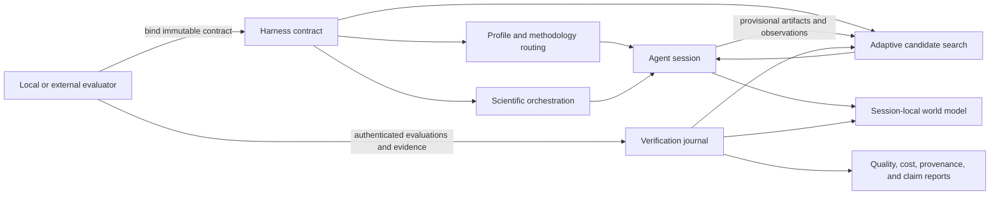

# Scientific research harness

OpenScience ships a generic, evaluation-bound harness for scientific reasoning, discovery, implementation, and verification. It does not ship benchmark repositories, source pins, dataset manifests, launch recipes, runner scripts, local environment files, or score tables.

The product boundary is deliberate:

- OpenScience owns the agent runtime, immutable research contract, orchestration, search, working memory, evidence rules, verification protocols, and reports.
- A caller-owned local or external evaluator owns tasks, data, hidden state, execution environments, scoring, evaluator credentials, and final result submission.
- The agent never receives the evaluator capability. OpenScience stores only its hash.
- Self-reported progress can guide search but cannot become verified evidence.

This keeps private and local evaluation setup out of the product while allowing any compatible evaluator to bind a run.

## System model



The direct ReAct path remains the default for ordinary work. Additional machinery activates only when the bound contract and inferred task profile require it.

## Immutable run contract

`HarnessAdapter.bind` accepts a generic caller-defined evaluation identity:

- `benchmark`: an opaque local or external suite identifier;
- `title`, `family`, and `task`: human-readable routing context;
- task version, task ID, and split;
- evaluator name, version, source class, and secret capability;
- objective, primary metric, direction, optional target, and optional secondary objectives;
- model, tools, skills, budgets, seed, and intervention mode;
- contamination policy with `hiddenTestsAccessible: false`;
- optional orchestration, search, audit, simulation, proof, replication, confirmation, and other verification protocols;
- generic methodology packs.

No identifier is resolved through a built-in catalog. Arbitrary caller-owned suite names are accepted. The adapter defaults to the neutral `custom` family and `react` profile when the caller does not declare them.

The stored contract is immutable. A second, byte-different bind for the same session is rejected. Evaluator, auditor, semantic-reviewer, claim-evaluator, and meta-harness capabilities are distinct, hashed, and timing-safe compared.

Numeric optimization requires:

- a named primary metric;
- an explicit maximize or minimize direction;
- a finite candidate budget;
- an `optimize` profile.

Secondary objectives require a preflighted objective-audit commitment. They never silently replace the primary metric.

## Continual world model

Each bound session has a small, editable world model inspired by reset-free continual-agent systems.

The model stores up to 48 typed entries:

- hypotheses;
- observations;
- strategies;
- memories;
- reusable skills;
- subagent roles.

Every entry has a stable key, content hash identity, confidence from 1 to 5, provenance-tagged evidence, update revision, and timestamp.

Confidence is authority-gated:

- agent-authored entries are capped at confidence 3;
- confidence 4 requires evidence beyond self-report;
- confidence 5 requires at least two non-self references, including evaluator or human evidence;
- evaluator-backed confidence can enter only through an authenticated evaluator route.

The base prompt is immutable and content-addressed from the contract. Refinement changes only the supplemental working state.

### Event boundaries

Events distinguish reasoning from changes in the external world:

- `analysis` preserves the current context epoch;
- tool results, evaluations, failures, milestones, stagnation, and manual events may advance it;
- failures, milestones, stagnation, and manual boundaries request immediate refinement;
- six events without refinement request a periodic refinement.

This allows a reasoning chain to continue through analysis calls while rebuilding mutable context only after relevant state changes.

### Refinement and rollback

A refinement:

- requires the exact current revision;
- accepts at most six small upserts or removals;
- limits added content to 12,000 characters;
- records the trigger and referenced evidence;
- snapshots the prior state;
- increments the context epoch;
- rejects stale concurrent writes.

The harness tool exposes self-attributed `world_status`, `world_event`, `world_refine`, and `world_rollback` actions. The evaluator API can apply stronger, authenticated refinements. Rollback restores a content-verified snapshot without changing the immutable base prompt.

The world model is injected into scientific agent prompts as escaped, bounded, explicitly mutable context. It never overrides higher-authority external evidence.

## Scientific profiles and methodology packs

Profiles select the lightest useful reasoning mode:

- `react`;
- `optimize`;
- `reproduce`;
- `theory`;
- `numerical`;
- `training`;
- `forecast`.

Methodology packs are composable product checks, not evaluator setup:

- statistics;
- biology;
- physics;
- PDE and numerical simulation;
- chemistry and materials;
- machine learning;
- forecasting;
- formal proof.

Each pack defines blocking and advisory checks. A passing external evaluation must include every blocking check selected by the contract, mark it blocking, and attach evidence. Duplicate, missing, failed, or evidence-free blocking checks are rejected.

## Adaptive scientific orchestration

`HarnessOrchestrator` derives task traits for decomposability, sequentiality, tool intensity, uncertainty, verification risk, novelty, and cross-domain scope. It selects one bounded topology:

- solo;
- centralized review;
- fork/join;
- tournament;
- evolutionary rounds;
- verifier loop.

The topology, reasons, worker limit, round limit, and independent-verifier requirement are persisted. Work units form a restart-safe DAG.

Task execution is receipt-bound. A worker completion must match:

- the exact work ID;
- assigned agent;
- canonical prompt;
- child session;
- measured tool and usage telemetry;
- artifact and evidence references;
- timestamps and outcome.

Producer lanes may resume only where the backend explicitly permits it. Critics, rankers, investigators, and verifiers remain fresh. Verification panels are blinded; one verdict cannot establish consensus.

Verifier-loop repair is backend-routed from structured verdicts. Adaptive evolution pauses at evaluator-authenticated marginal-utility checkpoints, so workers cannot self-score their way into more budget.

## Adaptive candidate search

`HarnessSearch` persists a content-addressed candidate graph with deterministic quality-diversity islands. It supports:

- independent roots;
- exploitation;
- lineage fusion;
- cross-island migration;
- paradigm divergence;
- branch and artifact deduplication;
- bounded parallel reservations.

Every recommendation is a lease bound to the exact state revision, lineage, search mode, island, and verified context. Stale leases are rejected transactionally.

Parallel dispatch reserves candidate-budget slots before work begins. Each reservation receives a distinct variation mandate. A reservation can be consumed once, released on failure, or automatically released when it rediscovers known artifact bytes.

Search state distinguishes:

- provisional agent observations;
- externally verified evaluations;
- final and non-final fidelity stages;
- Pareto archive membership;
- target attainment;
- stagnation and budget exhaustion.

Only externally authenticated final evaluations can:

- become the best candidate;
- enter the verified archive;
- authorize parent or inspiration lineages;
- populate retrospective memory;
- satisfy the run target.

## Evidence and verification protocols

The harness includes composable protocols for difficult scientific claims.

### Active audit

The evaluator commits an opaque probe pool. The backend selects probes using uncertainty reduction, failure UCB, failure-region diversity, and stratum coverage. Probe identities remain capability-protected. A terminal receipt binds the pool, observations, estimate, stopping state, transfer qualification, and audited artifact.

### Failure discovery

Topic-aware adversarial generation allocates attempts through deterministic UCB1. Correctness, topic fit, novelty, and target outcome are frozen before attempts. Generated cases can reveal failures but cannot silently alter the original population estimate.

### Runtime integrity

Integrity receipts bind the evaluated subject to an evaluator-owned event trace. The backend checks continuity, hidden-boundary violations, candidate mutation, evaluator identity, and exact terminal state.

### Evolution trace

Candidate lineage captures exact parent and child snapshots, source-file limits, canonical line hashes, changed-line counts, reintroduction, and cycles. Novelty diagnostics guide search but never become fitness.

### Evaluator qualification

An independent auditor uses a committed hidden fault suite to measure evaluator discrimination and calibration. The audited evaluator cannot authenticate its own qualification.

### Semantic audit and clean-room synthesis

Independent semantic review separates numerical success from scientific meaning. Clean-room synthesis isolates answer facts, checks citations and claim support, and binds a factuality receipt without leaking reviewer capabilities into the agent session.

### Simulation validation

Simulation contracts pin engine, command/config hashes, problem identity, reference solution, convergence levels, expected order, residual tolerance, invariants, and stress tests. Visual plausibility alone cannot pass.

### Formal proof

Formal validation binds the exact statement, proof relation, toolchain, dependency closure, source policy, transitive axiom closure, and verification tier. Compiler success alone is insufficient, and a proof of a repaired statement cannot masquerade as an exact proof.

### Replication and sealed confirmation

Replication freezes independent sampling units, strata, environments, and aggregation before results. Sealed confirmation separates search fitness from terminal claim evaluation. Cherry-picked replicates and agent-authored success claims cannot authorize promotion.

### Human-AI autonomy

Autonomy receipts derive provenance from a hash-chained interaction and artifact trace. The coarse intervention label is not treated as proof of autonomy.

### Controlled interventions and ablations

Matched replay, retuning, component ablation, repair, and transfer pairs are frozen before final evaluation. The backend verifies that paired contracts differ only in declared factors and derives direction-aware effects and intervals.

### Meta-harness qualification

Prompts, memories, skills, tools, middleware, subagents, and scaffolds can be treated as candidate harness components. Qualification uses frozen tasks, model panels, activation-required cases, cost accounting, and independent evidence. Meta-harness outcomes cannot self-authorize their own deployment.

## Retrospective memory and learned skills

Verified candidate outcomes enter task-scoped retrospective memory with evaluator identity, proposal, feedback, metrics, artifacts, and evidence. Retrieval returns a bounded mixture of relevant successes and failures. The prompt labels these as precedents, not instructions.

Learned skills follow a quarantine pipeline:

1. create an inactive proposal;
2. preserve exact content and origin;
3. attach paired held-out candidate/control evidence;
4. verify compatible immutable contracts and evaluator authority;
5. promote only an unchanged proposal that meets the qualification policy.

An agent cannot activate a skill by writing convincing prose about its own success.

## Evaluator interface

The core generic endpoints are:

| Method | Path                                                 | Purpose                                       |
| ------ | ---------------------------------------------------- | --------------------------------------------- |
| `POST` | `/harness/runs`                                      | Bind an immutable caller-owned evaluation run |
| `GET`  | `/harness/runs/:sessionID/contract`                  | Read the bound contract                       |
| `POST` | `/harness/evaluations`                               | Record an authenticated result                |
| `GET`  | `/harness/runs/:sessionID/evaluations`               | Read the evaluation journal                   |
| `GET`  | `/harness/runs/:sessionID/world`                     | Read continual working state                  |
| `POST` | `/harness/runs/:sessionID/world/refinements`         | Apply evaluator-backed world-state evidence   |
| `POST` | `/harness/runs/:sessionID/orchestration`             | Initialize orchestration                      |
| `GET`  | `/harness/runs/:sessionID/orchestration`             | Resume orchestration state                    |
| `POST` | `/harness/runs/:sessionID/orchestration/checkpoints` | Submit external utility evidence              |
| `GET`  | `/harness/runs/:sessionID/report`                    | Build a quality-cost report                   |
| `POST` | `/harness/compare`                                   | Compare compatible runs                       |

Additional routes expose the product verification protocols described above. Every capability-protected write validates its bound contract before mutation.

## Local storage

Harness state is stored under the OpenScience data directory, separated by protocol:

- contracts and hashed capability bindings;
- candidate search and orchestration state;
- continual world models;
- evaluation journals;
- audit, integrity, evolution, simulation, proof, replication, confirmation, and intervention receipts;
- retrospective memory;
- learned-skill proposals and qualification evidence;
- reports.

Writes use validated JSON state and revision checks. Content-addressed receipts make evaluator evidence replayable and resistant to substitution.

## Security and scientific integrity invariants

- Hidden evaluator state is never part of the agent contract.
- Evaluator secrets are hashed and never returned.
- Independent roles require independent capabilities.
- Agent observations remain provisional.
- High-confidence working beliefs require non-self evidence.
- The base prompt and run contract are immutable.
- Final promotion requires every bound blocking protocol.
- Candidate bytes, evidence references, and receipt identities are content-addressed where applicable.
- Search novelty, orchestration completion, and model confidence are not scientific proof.
- Reports separate measured results from qualified claims.

## Deliberately absent

This repository intentionally contains no:

- benchmark catalog;
- upstream repository pins;
- dataset download or mount instructions;
- source-audit manifest;
- execution recipe;
- launcher or pilot runner;
- local secret or environment template;
- benchmark-specific result table;
- claim that the harness is state of the art before external measurement.

Those belong in private or local evaluation workspaces. OpenScience remains the reusable product.

## Verification

From `backend/cli`:

```bash
bun run typecheck
bun test
```

When the API changes, regenerate the JavaScript SDK from the repository root:

```bash
./tooling/repo/generate.ts
```
