# Scientific benchmark harness

OpenScience has a benchmark-facing control plane for scientific agents. It binds an immutable run protocol before execution, routes the session through a domain-appropriate method, accepts results only from the bound evaluator, and keeps optimization, evidence, reusable memory, claims, and cost reporting attached to that protocol.

This is a **state-of-the-art-oriented harness architecture**, not a claim of state-of-the-art benchmark performance. A score becomes a SOTA claim only after an official, reproducible run beats the relevant public baseline under a comparable protocol. The harness is designed to make that test difficult to game and easy to audit.

## Design invariants

1. **The task is frozen before the agent runs.** Benchmark identity, version, task, split, evaluator, metric, direction, model, tools, skills, budgets, seed, intervention policy, and contamination policy are hashed into an immutable contract.
2. **The evaluator is outside the agent loop.** The orchestrator holds a bearer capability. OpenScience stores only its SHA-256 digest and never returns the token in the contract.
3. **Self-report is not evidence.** Agent observations cannot promote candidates, support scientific claims, enter verified memory, or qualify learned skills.
4. **Search has lineage and a hard budget.** Every candidate binds its parent(s), branch, proposal, and content-addressed artifact. Only final, externally evaluated passing candidates can become parents.
5. **Cheap screens cannot become final scores.** Optional fidelity stages execute in order. Only the last stage can promote a candidate, enter verified memory, appear as report quality, or qualify a skill.
6. **Scientific validity is domain-specific.** Benchmark adapters select blocking verification packs for statistics, biology, physics, PDEs, chemistry, ML, and forecasting.
7. **Learning is quarantined.** A trajectory can propose a skill, but cannot activate it. Promotion requires paired held-out candidate/control evidence across multiple tasks and an unchanged content hash.
8. **Quality is reported with cost.** Comparable reports include score, pass state, model and intervention metadata, total tokens, wall time, cost, candidate count, and search state.
9. **Coordination must earn its cost.** The contract can pin a topology, or a deterministic policy can choose direct, centralized, fork/join, tournament, or evolutionary execution from bounded task traits. Tool-heavy sequential work is not automatically expanded into a multi-agent swarm.
10. **Evaluation actively looks for blind spots.** An optional evaluator-owned audit uses committed opaque probes, uncertainty reduction, failure UCB, diversity, and stratum coverage. Its estimate must abstain while uncertainty remains above the contract threshold and cannot promote itself into benchmark evidence.
11. **Numerical validation is authenticated and recomputed.** A simulation claim pins the engine, effective problem, reference, convergence order, residual/invariant tolerances, and stress tests. A final pass must cite a passing evaluator receipt for the exact artifact.
12. **Feature attribution is predeclared and paired.** Harness architecture claims require at least three evaluator-authenticated, same-seed baseline/arm pairs frozen before any result exists. Exactly one declared contract factor may differ.
13. **The evaluator must earn trust.** An optional independent auditor capability scores the bound evaluator on a committed hidden suite of clean and realistically faulty outputs. Final passes require a content-addressed qualification receipt whose discrimination, calibration, and per-fault recall clear the frozen thresholds.
14. **Overthinking must earn another round.** Adaptive evolution advances only after a sequential, evaluator-authenticated utility checkpoint. Uncertain measurements cannot stop search, and a target hit or exhausted marginal gain preserves investigation and independent verification instead of declaring success.
15. **A benchmark name is not a runnable integration.** Held-out and release runs must pin an official runner revision, environment, dataset manifest, task manifest, evaluator artifact, and replayable baseline. Search and orchestration remain blocked until the external evaluator proves the complete launch suite and records a content-addressed readiness receipt.
16. **Official means source-identical.** Every named open benchmark adapter records its official repository at an exact commit and, when published separately, its dataset source. A launch using a fork, replacement runner, or replacement dataset is rejected rather than reported under the official benchmark name. Methodology families are labeled as such, and public reproduction subsets cannot be bound as hidden or release runs.
17. **A clean score requires a clean execution trace.** A strict runtime-integrity protocol commits its validator, trace schema, assigned model, forbidden model artifacts, independent contamination/API/lookup auditors, and hidden canaries before execution. Final success requires a content-addressed receipt for the exact run or candidate; OpenScience derives the six gates and rejects missing, failed, substituted, post-hoc, or cross-subject receipts.
18. **Native interfaces stay native.** A source-verified execution recipe records the official environment, entrypoint, ordered stages, typed bindings, produced artifacts, score selectors, and known limitations. CLI benchmarks remain argv contracts and Python libraries remain Python API contracts. Held-out or release runs for a verified recipe must bind its exact recipe and launch-driver digests; an unrelated generic command cannot pose as the official benchmark.
19. **Evolution is replayable, not inferred from score.** An optional optimization protocol freezes source roots, extensions, bounds, manifest schema, and an evaluator-owned validator. Every passing final candidate must cite an immutable receipt for its exact artifact and all declared parents. OpenScience recomputes parent deltas and ancestral line reintroductions; these diagnostics never become fitness or proof of novelty.
20. **Structural improvement must survive controlled intervention.** An optional evaluator-owned study is frozen after evolution tracing and before final evaluation. Exact same-condition replay, retuning or component interventions, and model/context/evaluator/split transfers alter only their declared factor. OpenScience derives paired effects and uncertainty from immutable observations; a required study gates promotion but never supplies fitness.
21. **Search compute follows verified progress, not a clock.** Numeric optimization contracts automatically pin `adaptive-search-v1`. OpenScience replays direction-aware improvement signals only from final evaluator events, adapts exploration intensity per island, routes candidate budget with decayed-reward UCB, opens new islands under measured global stagnation, and escalates to meta-guidance only after those controls fail. Every controller snapshot is revision-bound into the candidate lease.
22. **A lucky run cannot authorize promotion.** An optional replicated-evaluation protocol freezes the validator, environment, stratum and independent-cluster commitments, estimator, 95% interval, seed, target, and precision limit. OpenScience requires the complete crossed grid, recomputes mean, median, IQM, or pass rate, and promotes only when the conservative confidence endpoint clears the target. Each subject can freeze only one canonical receipt, so failed units, unfavorable repeats, and alternate retries cannot be selected away.
23. **Adaptive search cannot grade its own final claim.** An optional sealed-confirmation protocol commits distinct optimization and claim manifests, evaluator identities, validator, environment, metric, direction, and target. Search sees only optimization feedback. After search becomes terminal, the backend selects exactly one verified winner for one capability-isolated claim evaluation. Confirmation-enabled reports remain provisional until that immutable receipt exists and cannot enter comparison or the Pareto frontier before then.
24. **Scientific synthesis must prove its clean room and its arithmetic.** An optional synthesis protocol freezes the hidden reference and atomic-fact commitments, publication cutoff, allowed retrieval tools, complete trace/filter schemas, independent decomposer and judges, thresholds, and judge-failure policy. The backend replays every source decision, treats judge errors as inconclusive, derives factual precision, recall, contradiction penalty, and F1, and accepts only one canonical receipt for the exact run or candidate.

## System boundary

```mermaid
flowchart LR
    O["Benchmark orchestrator\nsecret evaluator capability + hidden tests"]
    L["Official benchmark launcher\npinned runner + data + baseline"]
    N["Source-verified native recipe\ntyped bindings + artifacts + metric"]
    C["Immutable run contract"]
    A["OpenScience agent session\nprofile + domain packs"]
    Q["Conditional scientific coalition\npersisted role DAG + bounded workers"]
    G["Candidate graph\nindependent roots + lineage"]
    H["Verified adaptive controller\nlocal intensity + global UCB + meta-guidance"]
    E["External evaluator\nstaged checks + score + usage"]
    V["Independent evaluator auditor\ncommitted clean + fault suite"]
    W["Evaluator qualification\nbackend-recomputed metrics"]
    U["Active audit\nopaque committed probes + GP posterior"]
    I["Evaluator-owned runtime monitor\ntrace + model lineage + hidden canaries"]
    X["Runtime integrity receipt\nbackend-derived six-gate outcome"]
    T["Evaluator-owned source tracer\ncanonical snapshot + exact parent deltas"]
    Y["Evolution trace receipt\nreplay + cycle diagnostics"]
    D["Evaluator-owned intervention runner\nfrozen one-difference pairs"]
    Z["Controlled intervention receipt\nstability + causal/transfer diagnostics"]
    P["Evaluator-owned replication runner\nfrozen tasks + independent clusters"]
    B["Replicated evaluation receipt\nrobust estimate + conservative bound"]
    F["Independent claim evaluator\none untouched hidden split"]
    FC["Sealed confirmation receipt\nterminal aggregate only"]
    CS["Evaluator-owned synthesis runner\nhidden atomic facts + complete retrieval trace"]
    SR["Clean-room synthesis receipt\nbackend-derived precision + recall + F1"]
    J["Immutable evaluation journal"]
    M["Verified hindsight memory"]
    K["Scientific claim ledger"]
    S["Quarantined skill lifecycle"]
    R["Quality-cost report"]

    O -->|bind| C
    O -->|authenticated launch checks| L
    O -->|materialize exact native interface| N
    N -->|recipe + driver commitments| L
    L -->|readiness receipt| C
    C --> A
    A --> Q
    Q --> G
    G -->|final evaluator events| H
    H -->|revision-bound lease| G
    G -->|artifact| E
    O --> E
    V -->|separate capability| W
    E -->|hidden-suite decisions| W
    W -->|qualification receipt| E
    E --> U
    U --> E
    A -->|sandbox, network, and model events| I
    O --> I
    I -->|authenticated evidence| X
    X -->|required receipt| E
    G -->|candidate + declared parents| T
    O --> T
    T -->|authenticated manifests| Y
    Y -->|required candidate receipt| E
    Y -->|bind exact evolved artifact| D
    O --> D
    D -->|authenticated paired outcomes| Z
    Z -->|optional promotion gate| E
    C -->|frozen uncertainty protocol| P
    G -->|candidate artifact| P
    O --> P
    P -->|complete committed grid| B
    B -->|required conservative receipt| E
    G -->|server-selected terminal winner| F
    O -->|distinct claim capability| F
    F -->|one committed evaluation| FC
    C -->|frozen synthesis protocol| CS
    O -->|hidden reference + evaluator capability| CS
    CS -->|authenticated atomic judgments| SR
    SR -->|required factual F1| E
    E -->|authenticated result| J
    J --> G
    J --> M
    J --> K
    J --> S
    J -->|legacy final or provisional optimization| R
    FC -->|sole quality source when bound| R
```



The bearer capability and hidden tests must live in a separate process, container, VM, or account that the agent cannot inspect. Application-level hashing prevents accidental drift and API forgery; it is not an operating-system sandbox. OpenScience's ordinary agent runtime can execute local code, so a same-user process with unrestricted filesystem access is outside this threat model.

## Run lifecycle

### 1. Bind

The orchestrator calls `POST /harness/runs` before the model sees the task. The request selects a version-agnostic adapter and supplies the exact benchmark version and evaluator protocol.

```json
{
  "schemaVersion": 1,
  "runID": "mle-2026-08-task-17-seed-3",
  "sessionID": "session-id",
  "benchmark": "mle",
  "version": "official-release-sha-or-version",
  "taskID": "competition-id",
  "split": "held_out",
  "evaluator": {
    "name": "official-evaluator",
    "version": "evaluator-sha",
    "source": "benchmark",
    "token": "out-of-band-secret-with-at-least-32-characters"
  },
  "objective": "Maximize the official held-out score",
  "orchestration": {
    "topology": "evolution",
    "maxWorkers": 2,
    "maxRounds": 3,
    "minIndependentVerifiers": 2,
    "adaptive": {
      "protocolVersion": "marginal-utility-v1",
      "minRounds": 2,
      "patience": 1,
      "minUtilityGain": 0.02,
      "maxUncertainty": 0.05,
      "targetUtility": 0.95
    }
  },
  "audit": {
    "mode": "hybrid",
    "budget": 50,
    "minSamples": 10,
    "tolerance": 0.02,
    "maxUncertainty": 0.05,
    "targetFailures": 8
  },
  "launch": {
    "protocolVersion": "benchmark-launch-v1",
    "runner": {
      "repository": "https://github.com/openai/mle-bench",
      "revision": "507f92e1138bb6e40dac5c6ee7a6758e6424bf97",
      "entrypoint": "mlebench/cli.py",
      "commandSHA256": "1111111111111111111111111111111111111111111111111111111111111111",
      "environmentSHA256": "2222222222222222222222222222222222222222222222222222222222222222",
      "recipeSHA256": "abababababababababababababababababababababababababababababababab",
      "driverSHA256": "cdcdcdcdcdcdcdcdcdcdcdcdcdcdcdcdcdcdcdcdcdcdcdcdcdcdcdcdcdcdcdcd"
    },
    "dataset": {
      "name": "official-held-out-data",
      "source": "https://example.org/official-dataset",
      "revision": "release-2026-08",
      "manifestSHA256": "3333333333333333333333333333333333333333333333333333333333333333"
    },
    "taskManifestSHA256": "4444444444444444444444444444444444444444444444444444444444444444",
    "evaluatorSHA256": "5555555555555555555555555555555555555555555555555555555555555555",
    "validatorSHA256": "7777777777777777777777777777777777777777777777777777777777777777",
    "baseline": {
      "name": "official-reference-baseline",
      "artifactSHA256": "6666666666666666666666666666666666666666666666666666666666666666",
      "expectedScore": 0.5,
      "tolerance": 1e-9
    }
  },
  "recipe": {
    "recipeID": "mlebench-official-v2",
    "bindings": {
      "competitionList": "manifests/competitions.txt",
      "dataDir": "datasets/mlebench",
      "submissionManifest": "submissions/run.jsonl",
      "outputDir": "results/grading"
    }
  },
  "integrity": {
    "protocolVersion": "benchmark-integrity-v1",
    "validatorSHA256": "8888888888888888888888888888888888888888888888888888888888888888",
    "traceSchemaSHA256": "9999999999999999999999999999999999999999999999999999999999999999",
    "minEvents": 100,
    "minCoverage": 0.99,
    "assignedModel": {
      "name": "assigned-base-model",
      "baseArtifactSHA256": "aaaaaaaaaaaaaaaaaaaaaaaaaaaaaaaaaaaaaaaaaaaaaaaaaaaaaaaaaaaaaaaa",
      "configSHA256": "bbbbbbbbbbbbbbbbbbbbbbbbbbbbbbbbbbbbbbbbbbbbbbbbbbbbbbbbbbbbbbbb"
    },
    "forbiddenModelArtifacts": ["cccccccccccccccccccccccccccccccccccccccccccccccccccccccccccccccc"],
    "policy": {
      "testItemDerivation": "forbidden",
      "unapprovedExternalModels": "forbidden",
      "benchmarkLookup": "forbidden"
    },
    "auditors": [
      {
        "kind": "test_item_contamination",
        "name": "contamination-auditor",
        "version": "1",
        "promptSHA256": "dddddddddddddddddddddddddddddddddddddddddddddddddddddddddddddddd"
      },
      {
        "kind": "external_model_use",
        "name": "api-auditor",
        "version": "1",
        "promptSHA256": "eeeeeeeeeeeeeeeeeeeeeeeeeeeeeeeeeeeeeeeeeeeeeeeeeeeeeeeeeeeeeeee"
      },
      {
        "kind": "benchmark_lookup",
        "name": "lookup-auditor",
        "version": "1",
        "promptSHA256": "ffffffffffffffffffffffffffffffffffffffffffffffffffffffffffffffff"
      }
    ],
    "hiddenCanaryManifestSHA256": "1212121212121212121212121212121212121212121212121212121212121212",
    "minHiddenCanaries": 8
  },
  "evolution": {
    "protocolVersion": "evolution-trace-v1",
    "validatorSHA256": "1313131313131313131313131313131313131313131313131313131313131313",
    "manifestSchemaSHA256": "1414141414141414141414141414141414141414141414141414141414141414",
    "lineAlgorithm": "sha256-exact-line-v1",
    "roots": ["src"],
    "extensions": [".ts", ".py"],
    "exclude": ["vendor"],
    "maxFiles": 10000,
    "maxFileBytes": 10000000,
    "maxTotalBytes": 100000000,
    "maxSourceLines": 1000000,
    "maxChangedLines": 200000
  },
  "interventions": {
    "protocolVersion": "intervention-study-v1",
    "validatorSHA256": "1515151515151515151515151515151515151515151515151515151515151515",
    "requiredForPromotion": true,
    "minPairs": 3,
    "maxPairs": 5,
    "maxTotalPairs": 15,
    "confidence": 0.95,
    "required": ["model_transfer", "replay", "retune"],
    "rules": [
      { "family": "model_transfer", "mode": "max_regression", "threshold": 0.05 },
      { "family": "replay", "mode": "max_absolute_effect", "threshold": 0.01 },
      { "family": "retune", "mode": "min_effect", "threshold": 0.02 }
    ]
  },
  "simulation": {
    "kind": "pde",
    "engine": {
      "name": "reference-solver",
      "version": "1.2.3",
      "commandSHA256": "aaaaaaaaaaaaaaaaaaaaaaaaaaaaaaaaaaaaaaaaaaaaaaaaaaaaaaaaaaaaaaaa",
      "configSHA256": "bbbbbbbbbbbbbbbbbbbbbbbbbbbbbbbbbbbbbbbbbbbbbbbbbbbbbbbbbbbbbbbb"
    },
    "problemSHA256": "cccccccccccccccccccccccccccccccccccccccccccccccccccccccccccccccc",
    "reference": {
      "kind": "manufactured",
      "identity": "manufactured-solution-v1",
      "sha256": "dddddddddddddddddddddddddddddddddddddddddddddddddddddddddddddddd"
    },
    "validation": {
      "errorNorm": "relative L2",
      "minLevels": 3,
      "maxLevels": 6,
      "expectedOrder": 2,
      "orderTolerance": 0.2,
      "maxResidual": 1e-8,
      "invariantTolerances": { "mass_drift": 1e-6 },
      "requiredStressTests": ["solver_tolerance_sensitivity", "reference_replay"]
    }
  },
  "metric": { "name": "score", "direction": "maximize" },
  "fidelities": [
    { "id": "smoke", "final": false, "maxWallTimeMs": 300000 },
    { "id": "official", "final": true, "maxWallTimeMs": 43200000 }
  ],
  "model": { "provider": "provider", "name": "model", "effort": "high" },
  "tools": ["read", "bash", "edit"],
  "skills": [],
  "budget": { "steps": 200, "candidates": 30, "tokens": 1000000, "costUSD": 100 },
  "seed": 3,
  "intervention": "autonomous",
  "contamination": {
    "policy": "Hidden tests and outputs stay outside the agent process",
    "hiddenTestsAccessible": false,
    "publicDataCutoff": "2026-08-01"
  },
  "createdAt": 1785859200000
}
```

Rebinding the session with any changed field or evaluator capability fails.

#### Prove launch readiness before execution

Every catalog manifest reports `execution: external_runner_required`: the adapter supplies scientific methodology and routing, not a bundled official runner. A held-out or release bind is rejected unless it includes `benchmark-launch-v1`. The external evaluator must then submit all eight checks to `POST /harness/launches/receipts`:

Catalog entries distinguish three source states:

- `official_open` pins the official repository commit, integration-critical paths, and published dataset source;
- `official_subset` identifies a public reproduction subset, its exact scope, and its integrity files; and
- `methodology_only` makes explicit that the adapter is a reusable scientific method, not an official benchmark integration.

They separately distinguish recipe readiness: `source_verified` means the native driver, environment anchors, artifacts, and metric selectors have been inspected at the pinned revision; `pending_source_verification` means the source is pinned but the executable contract is not yet trusted; `blocked_upstream` cites a pinned source path containing a concrete blocker that prevents an unchanged official launch; and `not_applicable` is reserved for methodology families without one official runner. OpenScience currently publishes source-verified recipes for all sixteen non-blocked official sources: BixBench, Biomni-Eval1, the GeneBench-Pro public package, PDEBench, ChemBench, MatSciBench, MLE-bench, ALE-Bench, ResearchClawBench, PaperBench grading, ScienceAgentBench, DiscoveryBench, SciCode, LABBench2, SciAgentArena's drug-discovery evaluator, and AInsteinBench. PostTrainBench is upstream-blocked on its HTCondor-only launcher; WeatherBench2 is blocked because its current script marks an undeclared flag as required; CORE-Bench is blocked because its unmaintained harness redirects to the now-archived HAL harness; CritPt is blocked because its public grader key can only be supplied through credential-bearing argv; AstaBench is blocked because its official two-phase wrapper requests a frozen default solve environment while the pinned repository omits and explicitly ignores the root `uv.lock`; and SciConBench is blocked because its pinned end-to-end runner owns model/provider execution but exposes no unchanged external-conclusion entrypoint that emits one stable official score artifact. No catalog adapter is left in pending source verification. These statuses are deliberately narrower than “runnable”: real data, credentials, evaluator isolation, replay artifacts, baseline evidence, and public-versus-hidden scope still have to pass launch readiness.

Materialize a verified recipe with `POST /harness/benchmarks/:benchmark/recipe`. Recipe v2 bindings are typed as confined relative paths, identifiers, integers, or closed choices, and path bindings may enforce a required filename suffix; stage inputs, outputs, and file artifacts are checkout-relative, while a driver may explicitly document a path relative to its confined working directory. Python stages name prior-stage receivers, evaluator-supplied values bind to named parameters, and integer bindings materialize as numbers rather than stringly typed kwargs. Return artifacts identify the exact produced value; file artifacts enforce match cardinality; metric extraction uses typed JSON-path, JSONL-record-path, CSV-column, pickle-tuple, or text-ratio selectors. The materializer rejects missing or undeclared keys, dangling or forward value references, duplicate values, ambiguous artifacts, absolute and escaping paths, wrong file suffixes, invalid identifiers, out-of-range integers, substituted choices, and recipe/benchmark mismatch. Its output preserves the official interface rather than flattening it: BixBench and MLE-bench use argv stages; ChemBench, Biomni, and the GeneBench-Pro reference grader use their Python APIs; PDEBench preserves its exact one-dimensional advection FNO Hydra overrides, derived checkpoint/result names, and six evaluator metrics; MatSciBench fixes a model registry entry to preserve credential and filename semantics; ALE-Bench preserves its official 15-sample/16-refinement launcher; PaperBench preserves rubric-tree grading; ScienceAgentBench preserves the verified split, Docker evaluator, and JSONL row metrics; DiscoveryBench preserves its official facet-scoring API; LABBench2 preserves its content-addressed external-runner protocol and tag/mode matrix; SciAgentArena preserves its per-task four-stage waterfall scores; AInsteinBench preserves its Docker question-suite evaluator and result array; SciCode preserves executable numeric tests; and ResearchClawBench preserves its batch CLI plus built-in workspace scoring.

Use `run-benchmark-pilot` to preflight and execute a materialized v2 recipe in the evaluator-owned environment before constructing a held-out launch protocol. Its runner verifies clean Git/source state, commitments, anchors, environment files, runtime adapters, secrets by name, stage inputs/outputs, and initially absent artifacts. Every input not tracked by the exact source revision or produced by an earlier stage must carry an expected file or directory SHA-256 in the pilot manifest; ignored candidate files are never trusted by path alone. Execution invokes no shell, preserves named Python object flow, records every stage input as source-tracked, content-committed, or derived, rejects mutation of tracked source files, hashes logs and artifacts, enforces cardinality, extracts typed metrics, and returns a content-addressed pilot receipt. A pilot proves integration conformance, not an official score: promote it only after `verify-benchmark-launch` binds deterministic replay, hidden isolation, artifact round-trip, and baseline evidence.

For a named official adapter, the bound runner repository and commit must match the catalog pin, and a separately published dataset must match its catalog source. OpenScience deliberately rejects source-substituted launches. GeneBench-Pro is currently cataloged as the 10-case public package out of 129 total cases, so it can support validation and reproduction but cannot be labeled as a hidden or release benchmark run.

Use the bundled `audit-benchmark-sources` skill to maintain those records. Its executable auditor fetches every pinned commit without blobs, verifies the catalog-declared runner/evaluator paths at that commit, resolves the current default head, probes separately published dataset endpoints, validates public-subset cardinality, and emits a content-addressed report. An unreachable pin, missing required path, unresolved head, unavailable dataset, or future-dated check fails the audit. A newer upstream head or an old check date creates a review item but never moves a trusted pin automatically. Updating a pin requires inspecting upstream changes and rerunning `verify-benchmark-launch` against the proposed revision.

- clean checkout at the exact 40- or 64-character source revision;
- locked environment replay;
- exact task-manifest load;
- exact evaluator load;
- hidden-data boundary isolation;
- deterministic replay;
- artifact round-trip; and
- pinned baseline replay.

Use the bundled `verify-benchmark-launch` skill from the evaluator-owned launcher to inspect the real Git checkout, environment locks, dataset and task bytes, evaluator bytes, hidden-mount canaries, replay outputs, serialization round trip, and public baseline. For a source-verified adapter, give the validator the exact materialized recipe artifact; it independently verifies the artifact bytes, native launch-stage driver digest, recipe commitment, and entrypoint. Bind the report's `protocol` before agent execution, then submit its `validator`, `checks`, `baselineScore`, and evidence. The contract pins the validator script SHA-256; the receipt is rejected if its exact executable does not match.

OpenScience derives the pass state. It rejects a partial or substituted check set, a substituted validator, and recomputes baseline error against the frozen tolerance. Failed attempts remain in the append-only journal. Receipts bind the full contract fingerprint, evaluator identity, protocol, validator and manifest identity, evidence, evaluator timestamp, and server-owned record time into their SHA-256 identity; edited storage fails validation. A separate content-derived submission ID preserves retry idempotence without trusting the submitter's clock. The bearer capability never enters the receipt.

Search and scientific orchestration will not initialize until a passing receipt exists. Every final passing evaluation must cite the exact receipt and must occur after it. This separates four states that older catalog-only integrations conflated: supported methodology, bound official protocol, launch-ready runner, and externally verified result.

#### Prove runtime integrity before accepting a score

Launch readiness proves that the official substrate loaded correctly; it does not prove that the candidate avoided test-specific training-data derivation, an unauthorized model API, model substitution, benchmark lookup, or trace omission while optimizing. A run can therefore bind `benchmark-integrity-v1`. The contract freezes:

- the exact validator and normalized trace-schema SHA-256;
- minimum event count and coverage;
- assigned base-model weights/config and known forbidden model artifacts;
- the strict test-item derivation, unapproved external-model, and benchmark-lookup policy;
- three distinct audit identities and prompt commitments; and
- the hidden-canary manifest and minimum coverage.

Use the evaluator-owned `verify-benchmark-integrity` skill to inspect a real JSONL trace captured outside the candidate sandbox. Its executable validator rejects sequence gaps and time reversal, hashes the trace, counts explicit dropped events, unapproved model calls, benchmark lookups, unique hidden canaries, and violations, checks measured model-lineage fields, and preserves independent `clean`, `flagged`, or `abstain` auditor decisions. It emits a token-free submission so the evaluator capability is injected only in memory at the authenticated API boundary.

`POST /harness/integrity/receipts` rejects a changed protocol, validator, auditor identity, pre-contract trace, future or pre-trace timestamp, nonexistent candidate, or artifact mismatch. The backend then derives exactly six checks: trace completeness, model identity, test-item contamination, external-model use, benchmark lookup, and hidden canaries. It stores the full evidence as a content-addressed, append-only receipt and re-derives its outcome whenever the journal is read. A final pass must reference a passing receipt recorded earlier for the same run or candidate; failed receipts remain durable evidence.

This is intentionally not a claim that one script can infer semantic contamination. Observable calls and canaries are derived programmatically; contamination classification remains a precommitted independent audit. The trace producer, model measurement, auditors, hidden tests, and capability must therefore remain beyond the candidate's operating-system boundary.

#### Preserve evolutionary source lineage

A score and a candidate artifact identify what won, but not what the evolutionary process changed. An optimize run can therefore bind `evolution-trace-v1`. The immutable contract pins the exact validator and manifest schema, exact-byte line hashing, included source roots and extensions, excluded paths, and file, byte, source-line, and changed-line ceilings.

Run the bundled `trace-evolutionary-candidate` skill in the evaluator process. It scans the unpacked candidate artifact, rejects symlinks and invalid UTF-8, hashes every exact non-empty source line, writes a canonical per-file manifest, reconstructs every parent manifest from an evaluator-controlled worktree, and rejects a parent whose local bytes do not match its already-recorded snapshot. It then writes one deterministic delta artifact per declared parent. The token-free submission carries only exact artifacts, manifests, parent receipts, and validator identity; inject the evaluator capability only at `POST /harness/evolution/receipts`.

OpenScience independently binds the subject artifact and complete parent set to the persisted search graph, verifies every parent receipt and delta content hash, and derives the current line multiset relative to the maximum multiplicity present in any parent. It recursively reconstructs ancestral deletions and reports depth, ancestor count, pairwise changed files and lines, new lines, deleted lines, reintroduced line multiplicity, reintroduced fraction, and cycle state. This handles two-parent fusion without double-counting lines inherited from either parent.

The journal is append-only, topological, content-addressed, and revalidated on every read. Parent, artifact, protocol, validator, timestamp, delta, or derived-diagnostic substitution fails closed. A trace receipt alone leaves the candidate unverified. When the protocol is bound, only a later passing final candidate evaluation that references the matching receipt may promote it; benchmark score remains the sole fitness authority. Legacy contracts remain valid because the protocol is opt-in.

#### Distinguish structural gains from retuning and evaluator coupling

Evolution provenance explains which bytes changed; it does not establish that the change is stable, causally important, or portable. An optimize run can therefore bind `intervention-study-v1` together with `evolution-trace-v1`. The contract freezes the evaluator-owned validator, required families, three-to-thirty-two pairs per family, total execution ceiling, 95% confidence policy, and one direction-aware threshold per family.

Run the bundled `design-replay-interventions` skill after the exact candidate has an evolution receipt and before its final evaluation. It validates a matrix whose cells commit the artifact, seed, model, context, evaluator, split manifest, environment, and budget. `replay` changes nothing; `retune`, `ablation`, and `repair` change only the artifact and keep the evolved candidate as the arm; `model_transfer`, `context_transfer`, `evaluator_transfer`, and `split_transfer` change only the named condition while evaluating the same candidate. The resulting plan is server-timestamped and immutable, so results cannot choose their own controls post hoc.

The external evaluator executes each control and arm independently, then records the exact target hash, score, status, evidence, and evaluation time. OpenScience keeps this append-only observation journal separate from candidate fitness and revalidates plan hashes, one-difference semantics, contiguous pair indexes, unique pair/role slots, submission and outcome derivations, timestamps, complete execution, and receipt identity on every read. The assessment derives direction-aware paired effects, sample standard deviation, standard error, and 95% Student interval. Replay requires every absolute effect to stay within tolerance; retuning, ablation, and repair require a lower confidence bound above the frozen minimum with no regression; transfers forbid any excessive regression and require the lower bound to clear the negative tolerance.

`failed` or missing cells cannot disappear into a smaller sample. An overlapping interval remains `inconclusive`. When `requiredForPromotion` is true, a later passing final candidate evaluation must cite the passing receipt and must postdate every intervention observation and the server assessment. The receipt qualifies a scoped stability, attribution, or transfer claim; it is never a benchmark score, search reward, novelty score, or SOTA result.

### 2. Execute through a profile

The contract overrides heuristic routing. Unbound interactive sessions use a conservative `react` default and select a specialized profile only from strong task signals.

| Profile     | Intended work                                       | Required discipline                                                |
| ----------- | --------------------------------------------------- | ------------------------------------------------------------------ |
| `react`     | Direct tool-using tasks                             | Smallest reliable execution path                                   |
| `optimize`  | MLE, algorithm, or score optimization               | Candidate lineage, external scores, bounded exploration            |
| `reproduce` | Papers, published analyses, and benchmark artifacts | Claim extraction, protocol replay, clean verification              |
| `theory`    | Analytical physics and mathematical derivation      | Assumptions, dimensions, limits, independent route                 |
| `numerical` | PDEs and simulation                                 | Equation/BC/IC pinning, stability, convergence, reference solution |
| `training`  | Fine-tuning and post-training                       | Data/model identity, checkpoints, held-out evaluation, compute     |
| `forecast`  | Weather and spatiotemporal prediction               | Lead-time portfolio, calibration, leakage, baseline, compute       |

### 3. Orchestrate only when justified

`POST /harness/runs/:sessionID/orchestration` freezes a deterministic role graph beside the immutable contract. Its selector considers decomposability, sequentiality, tool intensity, uncertainty, verification risk, novelty, cross-domain structure, and available coordination budget.

| Topology      | Use case                                               | Role structure                                                          |
| ------------- | ------------------------------------------------------ | ----------------------------------------------------------------------- |
| `solo`        | Small-budget, sequential, or low-coordination work     | One direct generation unit                                              |
| `centralized` | Tool-heavy or high-risk work with limited parallelism  | Generate → reflect → independently verify                               |
| `fork_join`   | Decomposable analytical and computational work         | Generate ∥ simulate → synthesize → independently verify                 |
| `tournament`  | Uncertain, verification-sensitive hypothesis selection | Independent generation → cluster → reflect → pairwise rank → verify     |
| `evolution`   | Novel, open-ended search                               | Generate → cluster → reflect → rank → evolve/diverge, repeated by round |

Every work unit has a content-derived identity, ordered dependencies, a role-specific agent, and a proportional allocation from the contract budget. A new run uses `task-attested-v1`: the Task tool must bind the ready work ID before execution and persists a content-addressed receipt for the exact work, child session, Task turn, agent, canonical and full prompt hashes, measured per-turn usage, tool-call counts, timestamps, and outcome. Pending work cannot settle without this receipt; one Task turn cannot attest multiple units; the caller cannot substitute a session or overwrite measured usage. Version-one and version-two persisted states migrate into an explicit `claimed-v1` compatibility policy rather than retroactively inventing receipts.

Fresh-session isolation remains mandatory for ordinary roles. Evolution is the narrow exception: the server assigns two persistent producer lanes, and only generation/evolution work in the same lane may resume that lane's exact Task session. This preserves a producer's solve-test-repair memory while critiques, rankings, investigations, and verifiers remain fresh. Failure cancels transitive descendants without erasing independent roots. Restarts reload the exact graph, Task receipts, and producer sessions rather than re-planning them.

Upstream communication is deliberately bounded to summaries plus artifact and evidence references. Verifiers run in distinct child sessions, cannot see each other's verdicts, and must return `support`, `reject`, or `abstain` with calibrated confidence and evidence-backed checks. The harness aggregates only after the whole panel settles: one verdict is `insufficient`, unanimous support/rejection is preserved, and any split or abstaining panel is `disputed`. Task receipts attest execution provenance, not scientific correctness. Receipts, internal reflection, ranking, verification, and consensus remain provisional; only the evaluator-authenticated journal can establish benchmark performance or scientific support.

Evolution may additionally bind `adaptive.protocolVersion = marginal-utility-v1`, a minimum round count, patience, minimum normalized utility gain, maximum uncertainty, and optional target utility. Every round then ends in `awaiting_checkpoint`: the next round remains locked until the out-of-band evaluator submits an evidence-backed checkpoint with its bearer capability. Checkpoints are sequential, immutable, server-timestamped, and cannot predate the completed work they assess. High-uncertainty measurements cannot trigger early stopping. A qualified target hit or a predeclared sequence of low marginal gains cancels unused future search, then dynamically reconnects the latest two candidates to failure investigation and the full blinded verification panel. The agent-facing tool cannot submit these checkpoints or award itself more budget.

### 4. Search without erasing failures

The optimizer is an open candidate graph rather than a single mutable working file. Numeric optimize adapters automatically bind the server-standardized `adaptive-search-v1` policy; no task-specific exploration knobs are exposed for leaderboard tuning.

- Numeric searches use `adaptive-v4`; nonnumeric and compatibility searches retain `leased-v3`. Every `start` or `status` response issues a content-addressed recommendation bound to the run, session, exact state revision, strategy, parents, inspirations, target island, requested generation mode, bounded verified context, and—under `adaptive-v4`—the exact replayed controller snapshot. A new artifact is admitted only when `recommendation_id` and lineage still match inside the state transaction, so concurrent callers cannot spend one recommendation twice or substitute a preferred branch. Retrying bytes already in the graph remains idempotent.
- The controller consumes only final `verified` events. It direction-normalizes the primary score, computes each island's EMA of squared positive normalized gains, and decays that signal on improvements, non-improvements, failures, and inconclusive outcomes. Observations, fidelity screens, intervention outcomes, secondary diagnostics, reservations, and raw compute never become adaptive reward.
- Local intensity follows the frozen inverse-square-root rule: productive islands shift toward refinement; stagnant islands shift toward orthogonal exploration. A content-derived draw makes the choice deterministic across restarts. The resulting signal, intensity, draw, and choice are embedded in the lease rather than trusted as mutable counters.
- Global routing uses decayed globally normalized improvement rewards divided by decayed visits plus minimum-visit UCB. This avoids both permanent breakthrough memory and the poor-island bias caused by large percentage gains from weak baselines. Minimization, zero, and negative metrics use explicit direction and absolute safe denominators.
- Searches begin with at most two active islands. When every active signal remains below the frozen threshold for the patience window, the controller opens one new island at a time up to the budget-derived maximum. Once all island capacity is active, the same measured condition triggers `diverge` with meta-guidance rather than another blind local mutation.
- Parallelizable search can atomically `dispatch` up to eight budget-backed sibling reservations against one recommendation. Open reservations count against the candidate budget, carry distinct content-derived identities, spread independent roots across islands, and may be consumed out of order exactly once. Serial proposals cannot steal reserved capacity. Failed work is explicitly released; rediscovered bytes release their reservation automatically; search termination releases every unused ticket.
- Every new parallel ticket carries a content-addressed `agentic-variation-v1` mandate. A batch rotates without repetition across the nine EvoTrace edit mechanisms—bug repair, external integration, architectural change, composition, local refinement, pruning, refactoring, efficiency, and hyperparameter tuning—in a strategy-sensitive order. The mandate is a primary search direction, not a fixed single-turn mutation: the producer may plan, inspect lineage, consult permitted knowledge, run tools, test, debug, and revise before returning one artifact.
- When `evolution-trace-v1` is bound, the external evaluator must record the exact source snapshot and every declared parent delta before final promotion. Verified search results surface backend-derived cycle and reintroduction diagnostics, but ranking, Pareto membership, target attainment, and stopping still use only evaluator metrics.
- When `intervention-study-v1` is bound, the external evaluator freezes and executes the required controlled matrix before final promotion. Intervention effects remain outside recommendation, ranking, Pareto, target, and stopping logic.
- When verified alternatives exist, centralized dispatch assigns distinct Pareto/branch lineages before reusing a route. Fusion portfolios vary the complementary verified branch; migration portfolios vary verified target islands; one-parent exploration, exploitation, and divergence rotate across verified branches. This diversification is opt-in with `dispatch`; the serial recommendation path is unchanged for sequential work.
- Reservations are centralized admission capabilities, not fitness. Creating, consuming, or releasing them cannot change `bestID`, the Pareto archive, evaluator results, or benchmark claims.
- The requested generation mode is adaptive: `single-pass` establishes the initial seed, `stepwise` reserves explicit planning/review for independent roots and structural fusion, migration, or divergence, and `diff` focuses local exploration and exploitation on a verified trajectory. A mode is an instruction, not a self-reported proof that the producer followed it.
- Recommendation context interleaves the selected verified parent and inspiration trajectories, is deduplicated, and is capped at six candidates. `recommendationContext` returns those exact artifacts, metrics, and evaluator feedback even if an older candidate falls outside the recent-candidate window. Observed, screened, failing, inconclusive, and unevaluated candidates cannot enter it.
- Candidate IDs hash parents, inspirations, branch, proposal, artifact URI, artifact SHA-256, and the complete server-issued lease. Adaptive candidates additionally retain creation and verified-event revisions; replay rejects a fully rehashed lease when its controller semantics do not match the earlier verified journal. Version-one through version-three states migrate without inventing adaptive provenance.
- Adaptive graphs begin with `min(2, budget-derived island capacity)` roots and open additional roots only under verified global stagnation. Compatibility graphs retain the historical bounded-root policy.
- A root must use a distinct branch while another live root with that branch exists.
- Descendants require final, evaluator-verified passing parents. A cheap screening pass is insufficient.
- A numeric adapter contract may predeclare up to eight unique secondary evaluator metrics and their directions only with a `design-benchmark-objectives` audit commitment. The audit pins the canonical plan, validator, normalized safety contract, and blocking guard IDs. Every passing final candidate must supply the complete vector.
- The search persists the non-dominated primary-plus-secondary Pareto archive. Auxiliary metrics preserve complementary candidates, but never change the official primary-score `bestID`, target, or SOTA claim.
- Adaptive selection allocates work by recent verified improvement rather than fixed budget fractions. Migration stays reward-neutral until its new artifact earns a final improvement; complementary fusion remains available before full meta-stagnation.
- Self-reported observations remain visible for debugging but cannot enter elite state or lineage.
- Passing, failing, and inconclusive final evaluations are immutable and retained as hindsight.

This combines breadth, multi-metric diversity, exploitation, fusion, and escape from strategy stagnation without allowing the model to award itself fitness. Quality-cost reports separately expose the archive size, objective vector, and objective-audit commitment, so an auxiliary evaluator metric cannot be confused with the benchmark's official score.

### 5. Cascade evaluation

Fidelity plans contain two to eight unique stages and exactly one final stage, which must be last. The journal enforces stage order per run or candidate. Every prior stage must pass all blocking checks before the next result can be recorded.

If a stage declares a wall-time or cost cap, the evaluator must report the corresponding usage and the result is rejected when it exceeds the cap. Screening evaluations can cull candidates and attach feedback, but cannot:

- become the search best;
- create descendants;
- satisfy final domain packs;
- enter verified retrospective memory;
- become the quality score in a report; or
- qualify a learned skill.

### 6. Actively audit performance and failure regions

An active audit is part of the external evaluator boundary. The run contract freezes its mode, budget, minimum sample count, kernel/noise settings, confidence multiplier, failure threshold, precision and abstention thresholds, objective weights, and optional failure target.

The evaluator initializes an audit with an immutable subject artifact plus two to 2,000 probe records. Each probe contains only:

- an opaque ID;
- a SHA-256 commitment to the hidden case bytes;
- a bounded numeric feature vector;
- a stratum label;
- an evaluation weight; and
- a prior loss estimate.

The hidden prompt, target, and expected output never enter OpenScience. Numeric features are standardized inside the audit before applying an RBF Gaussian-process surrogate.

`proactive-audit-v2` adds an opt-in transfer-qualified path based on ProEval's score-feature prior. The contract freezes the exact probe-pool digest, source-score manifest, source-selection artifact, PCA/GMM selection method, at least three unique source-model IDs, calibration size, calibration-error threshold, and whether a qualified terminal receipt is required for promotion. The evaluator preflight and backend independently derive the source-score manifest from the same ordered model IDs and per-probe loss matrix. Each v2 probe supplies that loss vector instead of caller-authored features or a prior mean. OpenScience derives the mean and centered `1 / sqrt(N - 1)` score features, so their linear kernel exactly reconstructs the empirical source-model covariance. A caller cannot substitute an RBF embedding, covariance feature, or favorable prior loss.

The first calibration probes follow a digest order fixed by the selection commitment, probe commitment, and probe ID. Their order is independent of target outcomes. When their mean absolute prior error exceeds the frozen threshold, transfer becomes `rejected`; remaining selection falls back to that outcome-independent order and the population estimate permanently abstains. Accepted transfer unlocks weighted Bayesian-quadrature variance reduction in performance mode and an uncertainty-weighted superlevel set in failure mode. This calibration rule is a conservative negative-transfer guard, not a statistical guarantee.

At each round, the audit selects exactly one probe. Performance mode maximizes the reduction in weighted integral variance. Failure mode combines posterior loss UCB with distance from already-discovered failures and under-covered strata. Hybrid mode combines both acquisitions using the contract weight. Selection is deterministic, persisted, and restart-idempotent.

Only the bound evaluator capability can initialize, select, read, or submit outcomes. An observation must cite evidence, cannot be changed later, and must label failure consistently with the frozen loss threshold. The audit stops on its sample budget, pool exhaustion, requested failure count, or—outside pure failure mode—sufficient posterior precision after the minimum sample count.

The audit state and terminal receipt carry posterior mean loss, standard deviation, a clipped 95% interval, failure count, stratum coverage, transfer status/error, and an explicit abstention bit; the quality report carries the cited receipt ID. Generated/adversarial cases are not population samples and use the separate topic-aware failure stream below; they cannot enter this pool or change its Bayesian-quadrature estimate.

A terminal audit can be sealed into a content-addressed receipt bound to the exact contract, subject artifact, committed pool, terminal revision, derived estimate, stop reason, and timestamps. Receipt parsing re-derives its content hash, identity, qualification, and the audit posterior. When `promotionRequired` is true, a passing final evaluation must cite a matching completed receipt whose transfer was accepted and estimate did not abstain. Missing, rejected, incomplete, corrupt, future, wrong-contract, wrong-subject, or cherry-picked-pool receipts fail closed. The receipt qualifies the audit protocol; it does not replace the benchmark's official authenticated score.

#### Topic-aware adversarial failure discovery

`topic-aware-failure-v1` is a separate evaluator-owned stream for failures outside the static audit pool. Its contract freezes the exact source-audit pool, a sorted opaque topic manifest, topic-model identity, generator identity, distinct correctness/topic/novelty validator identities, embedding identity and dimension, attempt budget, anchors per attempt, UCB exploration constant, failure threshold, and optional failure target. The generator and validators must have distinct prompt/config commitment pairs, so relabeling one execution identity cannot satisfy independence. The native preflight salts hidden topic definitions with at least 32 private random bytes before emitting their commitments, preventing dictionary recovery from predictable taxonomies, and rejects unknown manifest fields so evaluator capabilities cannot be silently carried through it. The threshold must equal the active audit threshold, and the budget must be large enough to initialize every topic arm.

The stream starts only from a valid terminal audit receipt for the exact subject artifact. OpenScience derives anchors from authenticated observed audit failures; a caller cannot submit, reorder, or substitute them. Topic selection is independent of anchors: every frozen topic is selected once in canonical order, then the backend recomputes UCB1 from the immutable attempt journal with content-addressed deterministic tie-breaking. A failure target cannot stop the stream until every topic arm has been initialized. A pending selection is restart- and concurrency-idempotent and cannot be spent twice.

Every generation call consumes one attempt, including generator errors, timeouts, invalid outputs, validator failures, and duplicates. A generated case must carry all three frozen validator results. Only a correctness-passing, selected-topic-passing, novelty-passing case can be evaluated on the target; its failure label is recomputed against the frozen threshold. Exact duplicate hashes cannot pass novelty. Invalid or inconclusive cases receive zero reward, while every attempted topic still receives a pull, preventing free retries and reward inflation.

Hidden case bytes, topic definitions, answers, target outputs, and evaluator capabilities remain outside OpenScience. The server receives commitments, validator evidence references, target loss, and an L2-normalized embedding from the frozen embedding model. It derives attempts, admissible count, invalid count, failures, samples-to-first-failure, failure rate, normalized topic entropy, per-topic pulls/rewards, and a dimension-bounded log-determinant embedding-diversity statistic. The latter uses the matrix determinant lemma so cost scales with the frozen embedding dimension rather than quadratically with the attempt budget.

A terminal stream seals `topic-aware-failure-receipt-v1`, binding the contract, exact subject artifact, source audit receipt and pool, full attempt lineage, replayed UCB statistics, stop reason, revision, and timestamps. Receipt validation transitively revalidates the source audit and both journals, including validator completeness, embedding shape, duplicate handling, threshold-derived labels, admissibility, rewards, timestamps, budget, and terminal semantics rather than trusting rehashed stored fields. `failureDiscoveryReceiptID` may be attached to an evaluation and quality report as robustness provenance, but it cannot change the official score, benchmark metrics, active-audit posterior, candidate fitness, confirmation split, or promotion decision.

### 7. Authenticate numerical simulation claims

An optional simulation contract freezes the physical and numerical protocol before execution: simulation kind; engine name/version; hashes of the effective command, configuration, and complete problem statement; reference kind/identity/hash; error norm; refinement range; expected order; residual and invariant tolerances; and mandatory stress tests.

The bound evaluator submits level measurements and evidence to `POST /harness/simulations/receipts`. OpenScience does not accept a producer-supplied pass flag. It recomputes decreasing resolution/error, requires every local observed convergence order to meet the frozen threshold, and checks residual bounds, every declared invariant, and the exact stress-test set. Both passing and failed receipts remain append-only and content-addressed.

A candidate receipt must name the candidate's exact artifact URI and SHA-256 from the search graph. A run receipt binds its output artifact to the run. A final passing evaluation under a simulation contract must cite a passing receipt for the same run or candidate; a missing, failed, wrong-contract, or wrong-artifact receipt blocks promotion. The capability and hidden reference outputs remain outside the agent process.

### 8. Promote only replicated conservative bounds

`replicated-evaluation-v1` is an opt-in final-promotion gate for benchmarks whose official score is noisy across tasks, seeds, trials, sites, laboratories, or other independent execution clusters. The contract freezes an exact Cartesian product of sorted stratum and cluster IDs, a SHA-256 commitment for every axis configuration, one runtime/environment commitment, the evaluator validator, estimator, 95% interval method, resampling seed, target, and optional maximum interval width. Numeric mean, median, and IQM protocols require at least five clusters and use a stratified percentile bootstrap; publication runs can predeclare up to 50,000 resamples. Pass-rate protocols require one Bernoulli stratum, at least three independent clusters, and a Wilson score interval. Multi-task binary rates use numeric zero/one scores with the stratified-bootstrap mean instead of falsely treating correlated cells as independent Bernoulli trials.

The evaluator uses `run-replicated-evaluation` outside the candidate process, executes every frozen `stratum × cluster` unit exactly once, and submits the matching axis commitments, environment hash, immutable output hash, status, score when admissible, timestamp, and evidence. `POST /harness/replications/receipts` rejects missing, duplicate, extra, substituted, drifted, future, pre-subject, or score-bearing failed units. OpenScience draws strata with replacement and clusters independently within each sampled stratum, uses numerically scaled compensated aggregation, and derives the point estimate, interval, width, conservative endpoint, and status without trusting a submitted summary. Numeric failed or inconclusive units fail closed without an aggregate; pass-rate inconclusive units remain inconclusive.

For maximized and pass-rate metrics, the lower endpoint must clear the frozen target; for minimized metrics, the upper endpoint must clear it. The final evaluation score must exactly equal the backend estimate. A best seed, favorable subset, point estimate, or self-authored replication statement cannot pass. The first valid receipt freezes the subject's canonical attempt; byte-identical retries are idempotent and changed retries are rejected. Receipts are content-addressed, contract/session/subject/metric/time bound, re-derived on read, and must exist before the subject's final evaluation. Replication is also part of report comparability, verified-memory scope, learned-skill comparison, and matched harness ablation.

### 9. Confirm one terminal winner on an untouched split

`sealed-confirmation-v1` closes the selection-bias gap left by fixed-candidate uncertainty intervals. The contract uses `development` or `validation` for repeated optimization and reserves a distinct `held_out` or `release` manifest for confirmation. It freezes the claim task, official source pin when applicable, validator, environment, evaluator identity, metric, direction, target, one-subject selection rule, terminal-only exposure, and fail-closed behavior. Optimization and claim evaluator tokens must be distinct. Public-subset adapters, blocked upstream runners, and unverified official recipes cannot pose as hidden confirmation integrations.

Only the claim evaluator capability can call `POST /harness/confirmations/selection`. OpenScience rejects active searches, open reservations, missing winners, non-passing or non-verified candidates, and winners without a durable verified optimization evaluation, then content-addresses the terminal revision, stop reason, exact candidate artifact, optimization-result digest, complete optimization-evaluation digest, and selection time. A receipt submission cannot name a candidate; it must echo the selected artifact hash and every frozen claim commitment. Completed results require the exact bound metric and a finite score, while failed or inconclusive executions cannot leak a partial claim score. The backend derives the verdict from the frozen direction/target and requires every domain-pack blocking check before a pass.

The first valid receipt becomes the session's canonical holdout attempt. Exact concurrent retries converge on that receipt; changed outputs, evidence, checks, metrics, or timestamps are rejected. The confirmation module never calls search verification, adaptive control, retrospective capture, claim feedback, or skill learning. The bundled `run-sealed-confirmation` skill preflights a token-free evaluator payload and keeps the capability in the secret-owning transport.

For a confirmation-enabled contract, optimization evaluations are deliberately absent from report quality. Before confirmation, the report is marked provisional, has no quality status or score, and is excluded from comparison and the Pareto frontier. After confirmation, the report uses only the sealed aggregate, claim evaluator identity, and receipt ID. The confirmation protocol also scopes retrospective memory and the report comparison key.

### 10. Verify with domain packs

Final passing results must contain evidence-backed receipts for every blocking check selected by the adapter.

| Pack       | Representative blocking checks                                                                     |
| ---------- | -------------------------------------------------------------------------------------------------- |
| Statistics | estimand, assumptions, effect size, uncertainty, multiplicity, exact replay                        |
| Biology    | identifiers, design, QC, batch structure, covariates, multiplicity, biological validity            |
| Physics    | assumptions, units, conventions, limiting cases, conservation, independent derivation              |
| PDE        | equation, domain, BC/IC, discretization, convergence, stability, invariants, reference, error norm |
| Chemistry  | identity, standardization, valence, stereochemistry, conditions, split leakage, physical validity  |
| ML         | data/model identity, held-out split, leakage, baseline, metric, seed variance, compute             |
| Forecast   | dataset/init/grid/leads, full metric portfolio, mode, calibration, temporal leakage, compute       |

An adapter can require no universal pack when the benchmark spans incompatible task types; the orchestrator may add task-specific packs at bind time. Pack selection is frozen in the contract and comparison key.

### 11. Reuse only verified hindsight

Retrospective entries are scoped by benchmark name, version, task, and evaluator. They contain the exact candidate artifact reference, branch, generation, external outcome, score, metrics, evidence references, evaluator feedback, and evaluation usage.

Retrieval combines query overlap, task affinity, and workflow stage. It deliberately returns a relevant contrasting failure beside a success when possible. Retrieved text is escaped, length-bounded, and explicitly labeled as precedent data rather than instructions.

### 12. Keep claims separate from execution reports

The claim ledger supports descriptive, statistical, causal, mechanistic, theoretical, and performance claims. Status is derived from verified evidence, never assigned by the agent.

- Observations can make a claim provisional, but not supported.
- A refuting verified source wins over supporting sources.
- Support requires the claim's blocking checks and enough distinct independence keys.
- Headline performance claims must bind an immutable artifact SHA-256.
- Clean replay, independent implementation, and independent derivation require a separate verifier session, fresh process, clean workspace, and exact source hash.
- Independent implementation/derivation additionally withhold the producer's output and require independent code or reasoning.

### 13. Promote skills only after held-out qualification

`/learn` and RSI distillation write inert proposals under `learned-skill-proposals`; skill discovery reads only promoted content under `learned-skills`.

Before a proposal exists, OpenScience checks its frontmatter, runtime-risk patterns, prompt-injection patterns, and suspicious content. The proposal is then immutable by content hash. Promotion requires:

- otherwise-identical candidate and control contracts;
- the candidate contract pinned to the exact proposed skill SHA-256;
- evaluator capabilities for both runs;
- held-out or release splits;
- at least three distinct benchmark tasks;
- at least two strict score improvements;
- no candidate failure and no regression;
- a held-out skill-trigger set with at least 20 examples; and
- trigger precision and recall of at least 0.8 for every attestation.

If later evidence introduces a regression before promotion, qualification returns to pending. Promoted content cannot accept more evidence; changes require a new versioned proposal.

### 14. Execute benchmark-native protocol skills

The bundled skill catalog includes executable protocols for work that is otherwise easy to describe but hard to audit:

| Skill                          | Executable contract                                                                                                                                                                                                    |
| ------------------------------ | ---------------------------------------------------------------------------------------------------------------------------------------------------------------------------------------------------------------------- |
| `active-failure-audit`         | Converts evaluator-private JSONL cases into a public manifest of opaque IDs and SHA-256 commitments without copying hidden case content.                                                                               |
| `design-benchmark-objectives`  | Separates optimization and claim splits, checks numeric directions, evaluator-owned delayed signals, anti-gaming guards, primary-score authority, and complete-vector policy, then emits a hashed adapter patch.       |
| `simulator-validation`         | Rejects refinement studies that miss decreasing resolution/error, expected convergence order, residual bounds, or declared invariants.                                                                                 |
| `scientific-ablation-design`   | Rejects attribution plans without exactly one budget-, seed-, split-, and evaluator-matched isolation arm for every predeclared mechanism.                                                                             |
| `verify-benchmark-launch`      | Inspects an exact Git checkout, locks, task/data/evaluator bytes, hidden boundary, deterministic replay, artifact round trip, and pinned baseline before official execution.                                           |
| `run-benchmark-pilot`          | Preflights and executes a source-pinned recipe v2 outside the candidate session, preserving native argv/Python value flow and emitting hashed stage, artifact, and typed-metric evidence.                              |
| `audit-benchmark-sources`      | Fetches every official pin, verifies required paths and datasets, checks subset cardinality, and reports upstream drift without silently changing trusted revisions.                                                   |
| `verify-benchmark-integrity`   | Validates evaluator-owned trace structure, derives observable model/lookup/canary counts, verifies committed auditor identities, and builds the token-free input for a backend-derived runtime-integrity receipt.      |
| `trace-evolutionary-candidate` | Captures a canonical evaluator-owned source manifest, verifies exact parent snapshots, writes deterministic parent deltas, and builds the token-free input for backend-derived replay and ancestral-cycle diagnostics. |
| `design-replay-interventions`  | Validates evaluator-owned exact one-difference replay, retuning, ablation/repair, and transfer matrices, then emits a token-free frozen plan and execution ledger.                                                     |
| `operate-adaptive-search`      | Validates an `adaptive-search-v1` lease, interprets its verified controller snapshot, and turns seed/explore/exploit/migrate/fuse/diverge plus an agentic variation mandate into one compliant candidate artifact.     |
| `run-replicated-evaluation`    | Preflights the exact frozen task-by-independent-cluster grid, commitment and environment binding, score/status rules, token isolation, and evidence required for a backend-derived conservative receipt.               |
| `run-sealed-confirmation`      | Preflights the backend-selected terminal artifact, distinct claim commitments, one-shot score/status rules, token isolation, and token-free payload for a capability-protected claim receipt.                          |
| `run-clean-room-synthesis`     | Salts hidden references and atomic facts, freezes retrieval/filter and judge commitments, and emits the token-free protocol for backend-replayed source decisions and factual F1.                                      |

Their scripts return machine-readable JSON and nonzero failure codes, so an orchestrator can use them as blocking gates instead of relying on prompt compliance. They validate the protocol and reported measurements; they do not manufacture hidden data, run an unavailable simulator, or turn an internal result into official benchmark evidence.

### 15. Attribute gains with matched ablations

`POST /harness/ablations` freezes a server-timestamped study before any paired evaluation exists. A study supports `profile`, `orchestration`, adaptive `search`, active `audit`, `simulation`, `evaluator_audit`, `semantic_audit`, scientific `synthesis`, `replication`, `fidelities`, and named `skill` or `tool` factors. It requires at least three distinct seeds on a held-out or release split. Within each seed, baseline and arm must have identical objectives, benchmark/evaluator protocol, packs, model, remaining tools/skills, budget, intervention, contamination policy, and seed after removing exactly the declared factor. Across pairs, every non-seed field and both factor values must remain identical.

The plan stores contract fingerprints plus hashes of the baseline value, arm value, and matched context; evaluator capabilities are never persisted. Initialization fails if any paired session already has an evaluation. Every accepted evaluation receives a server-owned receipt time, and assessment rejects receipts older than the plan, closing concurrent initialization races without trusting evaluator-supplied clocks.

After all runs settle, `POST /harness/ablations/:planID/assessment` reauthenticates every session, checks the frozen contract fingerprints, selects the final evaluator-verified run or best candidate outcome, and computes direction-aware paired effects. It reports the mean, sample standard deviation, standard error, a 95% paired Student interval, practical-effect threshold, and pair-level regressions. Support requires the interval's lower bound to exceed the predeclared minimum effect and no pair to violate the regression tolerance. Missing/failed pairs or a forbidden regression reject the attribution; an interval overlapping the threshold remains inconclusive.

The resulting content-addressed receipt establishes matched evidence for one declared harness mechanism. It does not by itself establish benchmark SOTA, generalize beyond the bound task, or rescue an incompatible official comparison.

### 16. Qualify the evaluator before trusting a pass

Authentication proves who submitted an evaluation; it does not prove that evaluator is competent. A run can therefore bind an `evaluatorAudit` protocol with an auditor identity and bearer capability distinct from the evaluator, a hidden-suite commitment, minimum clean and per-fault case counts, required fault classes, and thresholds for sensitivity, specificity, balanced accuracy, Brier score, and recall for every required fault.

The suite commitment is the SHA-256 returned by `HarnessJudge.commitment` over the case ID, content commitment, clean/fault label, and fault class sorted by ID; evaluator decisions are deliberately excluded. The independent auditor then submits those opaque fields plus the evaluator's accept/reject/abstain decision, failure probability, and evidence references to `POST /harness/evaluators/qualifications`. Substituting even one hidden case or label fails the frozen commitment. OpenScience recomputes the confusion matrix, calibration loss, aggregate rates, and per-class recall. Abstentions do not silently count as correct. The resulting receipt is immutable and content-addressed; neither bearer capability is stored.

A passing final evaluation under this protocol must cite a passing receipt recorded before the evaluation. The receipt must match the exact evaluator name, version, source, audit protocol, suite commitment, and independent auditor. Failed evaluations can still be retained without qualification, so this gate cannot erase negative evidence. Qualifications may be reused across runs only when the entire evaluator/audit identity is identical.

This mechanism does not claim that a finite meta-evaluation suite makes a judge infallible. It prevents an authenticated but untested judge from silently becoming ground truth and makes evaluator quality a versioned, ablatable part of the benchmark protocol.

### 17. Score scientific synthesis from frozen atomic facts

`scientific-synthesis-v1` covers SciConBench-style long-form conclusions where ordinary answer matching cannot distinguish genuine evidence synthesis from answer-key retrieval. Before execution, the evaluator privately salts the reference conclusion and every atomic reference fact, then binds only their commitments. The contract also freezes the public-question hash, cutoff date, canonical retrieval-tool subset, complete trace and filter-policy hashes, tool-event budget, distinct decomposer/precision/recall prompt commitments and frozen configurations, minimum fact count and component thresholds, and `inconclusive` handling for judge failures. The contamination cutoff must match, the primary metric must be maximized `factual_f1`, and the evaluator must pass an independent audit containing wrong-answer, unsupported-claim, and data-leakage faults.

The evaluator-owned runtime records every retrieval output in contiguous order. OpenScience independently blocks forbidden domains, reference-title matches, post-cutoff or undated sources, and duplicate outputs; a submitted decision that differs from replay is rejected. It then verifies the exact sorted hidden-fact manifest and generated-fact manifest, separates `judge_error` from factual verdicts, and derives factual precision as `(supported / generated) × (1 − contradicted / generated)`, recall as covered reference facts divided by all reference facts, and their harmonic-mean F1. Decomposition or judge errors make the result inconclusive rather than laundering infrastructure failure into an unsupported fact.

Each run or candidate can freeze only one canonical, content-addressed receipt. A passing final evaluation must cite that receipt and report exactly its backend-derived F1. The receipt authenticates protocol fidelity and arithmetic, not semantic truth by itself; semantic validity still depends on the separately qualified judges and retained evidence. The bundled `run-clean-room-synthesis` skill prepares the private commitments without emitting the answer, salt, prompts, configs, or evaluator capability. SciConBench remains honestly `blocked_upstream` until its official repository exposes an unchanged external-candidate scoring path; the protocol does not manufacture official compatibility.

The public policy is injected into both the main agent and any conditional coalition without exposing hidden commitments. Its exact protocol scopes verified hindsight, learned-skill comparisons, report comparison, and a dedicated matched-ablation factor, so conclusions or optimization traces from one hidden reference cannot silently transfer into another.

### 18. Compare only compatible runs

Legacy reports choose only a final evaluation. Confirmation-enabled reports choose only a canonical sealed claim receipt and exclude provisional optimization scores from comparison. Their comparison key hashes benchmark, version, task, split, evaluator identity/source, fidelity, adaptive-search, launch, runtime-integrity, evolution, controlled-intervention, simulation, evaluator-audit, semantic-audit, replicated-evaluation, sealed-confirmation, scientific-synthesis and objective-audit protocols, metric, direction, target, domain packs, and contamination policy. Cross-task or cross-protocol comparisons fail instead of normalizing unlike scores. Reports surface controller telemetry alongside the applicable evidence receipt.

Cost and wall time include both the agent trace and evaluator-reported stage usage. Direction-aware score deltas and the Pareto frontier are available through `POST /harness/compare`.

## Adapter catalog

An adapter manifest is a methodology and routing map, not an embedded copy of a benchmark runner and not evidence that the benchmark currently executes. Every manifest therefore declares `external_runner_required`. The official launcher owns workspace construction, hidden data, evaluator code, and task-specific score semantics; a concrete run pins those facts in its launch protocol and proves them with a readiness receipt before the harness executes.

| Family                    | Adapters                                                                                                             |
| ------------------------- | -------------------------------------------------------------------------------------------------------------------- |
| Data/statistics           | Statistical methodology, DiscoveryBench                                                                              |
| Biology                   | BixBench, LifeSciBench/life-science tasks, GeneBench/GeneBench-Pro, BioMni, LABBench2                                |
| Physics                   | Pure/agentic physics, PDE tasks, CritPt                                                                              |
| Chemistry/materials       | ChemBench, MatSciBench                                                                                               |
| ML                        | MLE-bench, post-training, ALE, weather, PaperBench                                                                   |
| General scientific agents | ResearchClawBench, SciConBench, reproducibility CORE-Bench, ScienceAgentBench, SciCode, SciAgentArena, AInsteinBench |

Every adapter is version-agnostic. A development/validation run must still bind an exact benchmark version, evaluator version, task ID, split, metric, budget, seed, and contamination policy. A held-out/release run additionally requires an exact official launch protocol and passing readiness receipt. Catalog presence alone must never be reported as runnable benchmark coverage.

## HTTP API

| Method | Route                                                | Purpose                                                       |
| ------ | ---------------------------------------------------- | ------------------------------------------------------------- |
| `GET`  | `/harness/benchmarks`                                | List adapter manifests                                        |
| `POST` | `/harness/benchmarks/:benchmark/recipe`              | Materialize a typed source-verified native execution recipe   |
| `POST` | `/harness/runs`                                      | Bind the immutable run and hashed evaluator capability        |
| `POST` | `/harness/runs/:sessionID/orchestration`             | Select and initialize a persisted scientific role DAG         |
| `GET`  | `/harness/runs/:sessionID/orchestration`             | Resume the current orchestration state                        |
| `POST` | `/harness/runs/:sessionID/orchestration/checkpoints` | Gate evolution using evaluator-authenticated marginal utility |
| `POST` | `/harness/audits`                                    | Commit an evaluator-owned opaque active-audit pool            |
| `POST` | `/harness/audits/:auditID/status`                    | Read capability-protected posterior and stopping state        |
| `POST` | `/harness/audits/:auditID/selection`                 | Select the next opaque probe commitment                       |
| `POST` | `/harness/audits/:auditID/observations`              | Record an immutable evaluator-authenticated probe outcome     |
| `POST` | `/harness/audits/:auditID/receipt`                   | Seal a content-addressed terminal active-audit receipt        |
| `POST` | `/harness/failure-streams`                           | Initialize a terminal-audit-bound adversarial stream          |
| `POST` | `/harness/failure-streams/:streamID/status`          | Read capability-protected failure-discovery state             |
| `POST` | `/harness/failure-streams/:streamID/selection`       | Select the next deterministic UCB1 topic and anchors          |
| `POST` | `/harness/failure-streams/:streamID/attempts`        | Record one validated generation attempt                       |
| `POST` | `/harness/failure-streams/:streamID/receipt`         | Seal a content-addressed failure-discovery receipt            |
| `POST` | `/harness/ablations`                                 | Freeze a same-seed, one-factor matched ablation               |
| `POST` | `/harness/ablations/:planID/assessment`              | Derive an immutable paired-effect assessment                  |
| `POST` | `/harness/evaluators/qualifications`                 | Audit a judge on a committed hidden fault suite               |
| `POST` | `/harness/evaluators/qualifications/:id`             | Read a qualification with the independent auditor capability  |
| `POST` | `/harness/launches/receipts`                         | Recompute and record official benchmark launch readiness      |
| `POST` | `/harness/launches/receipts/:id`                     | Read a capability-protected launch readiness receipt          |
| `POST` | `/harness/integrity/receipts`                        | Derive and record runtime-integrity gates                     |
| `POST` | `/harness/integrity/receipts/:id`                    | Read a capability-protected runtime-integrity receipt         |
| `POST` | `/harness/evolution/receipts`                        | Derive and record replayable evolutionary provenance          |
| `POST` | `/harness/evolution/receipts/:id`                    | Read a capability-protected evolution trace receipt           |
| `POST` | `/harness/interventions`                             | Freeze an evaluator-owned controlled intervention matrix      |
| `POST` | `/harness/interventions/:candidateID/observations`   | Record one immutable control or arm outcome                   |
| `POST` | `/harness/interventions/:candidateID/assessment`     | Derive the controlled paired-effect receipt                   |
| `POST` | `/harness/interventions/:candidateID/status`         | Read capability-protected intervention state                  |
| `POST` | `/harness/simulations/receipts`                      | Recompute and record a simulator validation receipt           |
| `POST` | `/harness/simulations/receipts/:id`                  | Read a capability-protected simulator validation receipt      |
| `POST` | `/harness/replications/receipts`                     | Recompute and freeze a conservative replicated result         |
| `POST` | `/harness/replications/receipts/:id`                 | Read a capability-protected replicated evaluation receipt     |
| `POST` | `/harness/confirmations/selection`                   | Resolve one capability-protected terminal winner              |
| `POST` | `/harness/confirmations/receipts`                    | Derive and freeze its one-shot claim result                   |
| `POST` | `/harness/confirmations/receipts/:id`                | Read the canonical sealed confirmation receipt                |
| `POST` | `/harness/syntheses/receipts`                        | Derive and freeze one clean-room scientific synthesis result  |
| `POST` | `/harness/syntheses/receipts/:id`                    | Read a capability-protected synthesis receipt                 |
| `POST` | `/harness/evaluations`                               | Record a staged evaluator-authenticated result                |
| `GET`  | `/harness/runs/:sessionID/contract`                  | Inspect the bound protocol                                    |
| `GET`  | `/harness/runs/:sessionID/evaluations`               | Inspect the immutable evaluation journal                      |
| `GET`  | `/harness/runs/:sessionID/report`                    | Build a quality-cost report                                   |
| `POST` | `/harness/compare`                                   | Compare compatible reports and identify Pareto-efficient runs |
| `GET`  | `/harness/skills`                                    | List quarantined skill proposals and qualification state      |
| `POST` | `/harness/skills`                                    | Create an inert, content-addressed proposal                   |
| `POST` | `/harness/skills/evidence`                           | Add paired evaluator-authenticated held-out evidence          |
| `POST` | `/harness/skills/:name/promotion`                    | Promote only a currently qualified, unchanged proposal        |

The generated JavaScript SDK exposes the same API.

## Research basis

The implementation borrows principles, not source code, from the following primary systems and papers:

| Source                                                                                                                                                                           | Principle reflected here                                                                                                                                                                              |
| -------------------------------------------------------------------------------------------------------------------------------------------------------------------------------- | ----------------------------------------------------------------------------------------------------------------------------------------------------------------------------------------------------- |
| [AlphaEvolve paper](https://arxiv.org/abs/2506.13131)                                                                                                                            | Programs receive multiple objective evaluator scores; a MAP-Elites/island-inspired database preserves diverse high performers for later evolution.                                                    |
| [AdaEvolve](https://arxiv.org/abs/2602.20133) and [released implementation](https://github.com/skydiscover-ai/skydiscover)                                                       | Couple per-island improvement EMA, decayed-reward UCB resource routing, dynamic populations, and stagnation-triggered tactics; OpenScience adds evaluator-only events and revision-replayable leases. |
| [Google DeepMind Co-Scientist](https://deepmind.google/blog/co-scientist-a-multi-agent-ai-partner-to-accelerate-research/)                                                       | Generate diverse hypotheses, critique/rank them, combine strong ideas, and spend substantial compute on verification.                                                                                 |
| [ProEval](https://deepmind.google/research/publications/238239/)                                                                                                                 | Actively discover failure regions and estimate capability from a small, strategically chosen evaluation subset.                                                                                       |
| [RLiable](https://arxiv.org/abs/2108.13264)                                                                                                                                      | Treat finite-run aggregate scores as random variables; report robust IQM and stratified-bootstrap uncertainty instead of only point estimates or favorable runs.                                      |
| [Structured Scaling for LLM-Based Optimization](https://arxiv.org/abs/2604.19341)                                                                                                | Evaluation-driven search can exploit a surrogate evaluator; keep promotion behind a frozen external validation protocol and conservative evidence.                                                    |
| [TRACE: Towards Structural Understanding of LLM Overthinking](https://deepmind.google/research/publications/203490/)                                                             | Detect verification and exploration that continue after their marginal utility has collapsed; stop against a predeclared control rule.                                                                |
| [Towards a Science of Scaling Agent Systems](https://arxiv.org/abs/2512.08296)                                                                                                   | Add agents conditionally: coordination can hurt sequential and tool-heavy work, while centralized structures control error amplification.                                                             |
| [Gram](https://deepmind.google/research/publications/252981/)                                                                                                                    | Audit autonomous agents for sabotage, overeagerness, and hidden side effects with an investigator distinct from the producer.                                                                         |
| [Realistic honeypot evaluations](https://deepmind.google/research/publications/253391/)                                                                                          | Include evaluation-awareness and realistic deployment-context failures instead of relying only on artificial judge tests.                                                                             |
| [PostTrainBench v1.1](https://posttrainbench.com/) and its [paper](https://arxiv.org/abs/2603.08640)                                                                             | Treat test-derived data, unauthorized API/model use, model substitution, and benchmark lookup as separately audited integrity failures rather than score improvements.                                |
| [Solipsistic superintelligence is unlikely to be cooperative](https://deepmind.google/research/publications/231466/)                                                             | Treat evaluation as an external, adaptive institutional boundary rather than a stationary feedback object controlled by the optimizing agent.                                                         |
| [RubricEval](https://arxiv.org/abs/2603.25133) and [Who Validates the Validators?](https://arxiv.org/abs/2404.12272)                                                             | Meta-evaluate judges on realistic failures and version criteria rather than treating an LLM judge as ground truth by default.                                                                         |
| [MLEvolve](https://github.com/InternScience/MLEvolve) and its [paper](https://arxiv.org/abs/2606.06473)                                                                          | Progressive multi-branch search, success/failure hindsight, adaptive single-pass/stepwise/diff generation, trajectory-aware evolution, and cross-branch fusion for MLE.                               |
| [CORAL](https://arxiv.org/abs/2604.01658)                                                                                                                                        | Let long-lived workers explore asynchronously against shared scored attempts and notes, with isolated workspaces, resource control, and heartbeat intervention.                                       |
| [AVO](https://arxiv.org/abs/2603.24517)                                                                                                                                          | Treat variation as an agentic plan/implement/test/debug loop with lineage, tools, knowledge, execution feedback, and persistent memory instead of a one-shot mutation.                                |
| [EvoTrace and EvoReplay](https://arxiv.org/abs/2605.20086)                                                                                                                       | Record the mechanism behind candidate edits and expose cycling, replay, ablation, and tuning gaps instead of interpreting the final score as structural innovation.                                   |
| [AI Scientist v2](https://github.com/SakanaAI/AI-Scientist-v2) and its [paper](https://arxiv.org/abs/2504.08066)                                                                 | Multiple independent experimental roots and agentic tree search rather than a single linear attempt.                                                                                                  |
| [Darwin Gödel Machine](https://arxiv.org/abs/2505.22954)                                                                                                                         | Preserve an open-ended archive with lineage; do not collapse self-improvement into one incumbent.                                                                                                     |
| [SkyDiscover](https://github.com/skydiscover-ai/skydiscover)                                                                                                                     | Island-style diversity, UCB selection, migration/fusion, staged evaluation, and strategy mutation after stagnation.                                                                                   |
| [GEPA](https://arxiv.org/abs/2507.19457)                                                                                                                                         | Feed detailed evaluator feedback into reflective search rather than optimizing from a scalar alone.                                                                                                   |
| [EvoScientist](https://github.com/EvoScientist/EvoScientist) and its [paper](https://arxiv.org/abs/2603.08127)                                                                   | Turn repeated observations into proposed reusable skills; OpenScience adds stricter quarantine and held-out promotion.                                                                                |
| [ResearchHarness](https://github.com/InternScience/ResearchHarness)                                                                                                              | Keep the benchmark substrate explicit, inspectable, tool-bounded, and traceable while isolating agent workspaces from evaluator state.                                                                |
| [PhysicsIntern](https://github.com/huggingface/physics-intern-skills)                                                                                                            | Use durable research state, fresh verification contexts, independent derivations/computations, and adversarial critique.                                                                              |
| [ResearchClawBench](https://arxiv.org/abs/2606.07591)                                                                                                                            | Evaluate end-to-end research against hidden target work and make protocol mismatch, evidence mismatch, and missing scientific core visible.                                                           |
| [SciConBench](https://arxiv.org/abs/2606.11337) and its [official implementation](https://github.com/hayoungjungg/SciConBench)                                                   | Evaluate time-bounded clean-room conclusion synthesis with atomic factual precision, recall, contradiction penalty, and F1 while explicitly preventing reference retrieval.                           |
| [Towards Self-Evolving Benchmarks](https://arxiv.org/abs/2510.00415)                                                                                                             | Require validate-by-reproduce trajectories and multi-level validation before dynamically evolved tasks can enter benchmark evidence.                                                                  |
| [The Ladder](https://proceedings.mlr.press/v37/blum15.html)                                                                                                                      | Repeated leaderboard feedback can overfit a holdout; restrict information and reserve independent final evaluation.                                                                                   |
| [Preserving Statistical Validity in Adaptive Data Analysis](https://arxiv.org/abs/1411.2664)                                                                                     | Treat adaptively selected analyses as a distinct statistical regime rather than ordinary fixed-hypothesis evaluation.                                                                                 |
| [The Reusable Holdout](https://arxiv.org/abs/1506.02629) and [Generic Holdout](https://arxiv.org/abs/1809.05596)                                                                 | Separate exploration from confirmation and limit what repeated holdout access can reveal.                                                                                                             |
| [DeepMind: Conjecture Machines and the validation bottleneck](https://deepmind.google/public-policy/conjecture-machines-ai-agents-and-the-new-validation-bottleneck-in-science/) | As agents generate more hypotheses, independent validation—not hypothesis generation—becomes the scarce trust boundary.                                                                               |

The expanded evaluation frontier is grounded in [PaperBench](https://openai.com/index/paperbench/), [computational reproducibility CORE-Bench](https://arxiv.org/abs/2409.11363), [ScienceAgentBench](https://arxiv.org/abs/2410.05080), [DiscoveryBench](https://arxiv.org/abs/2407.01725), [SciCode](https://arxiv.org/abs/2407.13168), [LABBench2](https://arxiv.org/abs/2604.09554), [SciConBench](https://arxiv.org/abs/2606.11337), [SciAgentArena](https://arxiv.org/abs/2606.12736), [AInsteinBench](https://arxiv.org/abs/2512.21373), and [AstaBench](https://allenai.org/papers/astabench).

## What remains before a SOTA claim

The harness is ready for benchmark integration, but architecture alone does not establish performance. For each target benchmark:

1. Pin an official repository/evaluator commit, dataset revision and manifest, task manifest, environment, invocation, baseline artifact/score, split, hardware class, model, tools, budget, seed policy, and intervention policy; pass the complete launch-readiness suite.
2. For strict hidden or post-training runs, capture an evaluator-owned execution trace and pass a contract-bound runtime-integrity receipt for the exact final artifact. For evolutionary optimization, additionally capture exact source manifests and parent deltas, run the predeclared controlled replay/retuning/transfer matrix when required, and reference both matching receipts on every passing final candidate.
3. Qualify any learned or hybrid evaluator against a separately controlled, committed meta-evaluation suite; retain official deterministic runners as the preferred ground truth where available.
4. Reproduce the strongest public baseline under exactly that contract.
5. Run ablations for profile routing, the complete adaptive-search controller, its local-intensity/global-routing/meta-guidance levels, multi-root search, fidelity screening, hindsight, fusion, replay diagnostics, domain packs, runtime integrity, evaluator qualification, and learned skills.
6. Bind the benchmark's prescribed repeat protocol—or a frozen task-by-independent-cluster replication contract—and require its conservative receipt instead of selecting the best seed or point estimate.
7. If optimization adaptively reused evaluator feedback, bind a distinct untouched claim split and evaluator capability, confirm only the backend-selected terminal winner, and keep the run out of final comparison until its sealed receipt exists.
8. Publish every final run, failed run, cost report, artifact hash, evaluator receipt, and contamination statement.
9. Call a result SOTA only when the official metric improves under a comparison the benchmark owners would accept.
